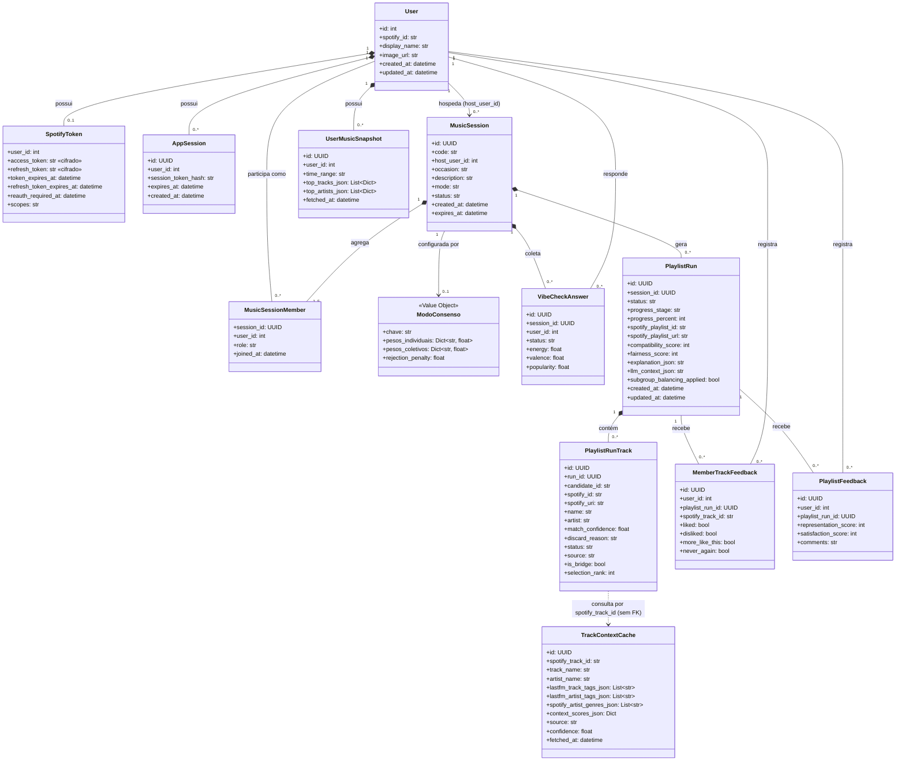

# 01 — Domínio persistente: Usuário, Sala e Contexto

Este diagrama corresponde 1:1 às 12 tabelas ORM de `app/db/models.py`, sem introduzir camadas de
`schemas`/`routers` (infraestrutura), que é onde a arquitetura FastAPI + SQLAlchemy + Alembic
efetivamente guarda o estado do produto. `MusicSessionMember` é modelada como uma classe associativa
explícita — não apenas uma associação N-N simples entre `User` e `MusicSession` — porque ela carrega o
atributo `role` ("host"/"member") que distingue o anfitrião dos convidados, e a composição
`MusicSession "1" *-- "1..5"` reproduz o limite de cinco integrantes por sala do RNF-05. `ModoConsenso`
foi modelada como um Value Object (não uma hierarquia de subclasses) porque é exatamente isso que o
código implementa: `CONSENSUS_MODES`, em `engine/weights.py`, é um dicionário de configuração
(pesos individuais, pesos coletivos e `rejection_penalty` por modo), e `MusicSession.mode` é apenas uma
string validada contra esse conjunto — não existe polimorfismo real a representar. Por fim,
`TrackContextCache` aparece sem associação formal (FK) com `PlaylistRunTrack`, porque no código ela é
de fato uma tabela de cache independente, consultada por `spotify_track_id` a partir do motor (ver
diagrama 02) e não referenciada por chave estrangeira — a dependência tracejada deixa essa
particularidade explícita em vez de forçar uma associação que não existe no schema.
