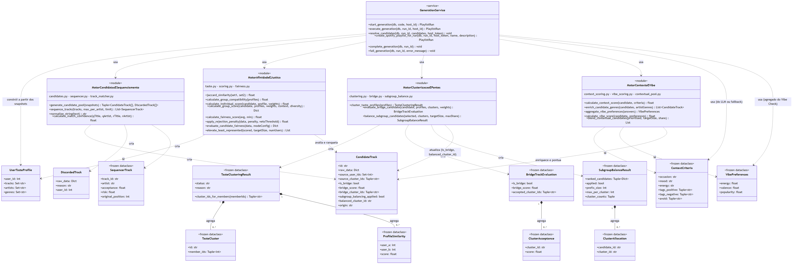

# 02 — Motor de Recomendação (Preference Negotiation Engine — PNE)

```mermaid
classDiagram
    class GenerationService {
        <<service>>
        +start_generation(db, code, host_id) PlaylistRun
        +execute_generation(db, run_id, host_id) PlaylistRun
        +resolve_candidates(db, run_id, candidates, host_token) void
        +create_spotify_playlist_for_run(db, run_id, host_token, name, description) PlaylistRun
        +complete_generation(db, run_id) void
        +fail_generation(db, run_id, error_message) void
    }

    class MotorCandidatasESequenciamento {
        <<module>>
        candidates.py · sequencer.py · track_matcher.py
        +generate_candidate_pool(snapshots) Tuple~CandidateTrack[], DiscardedTrack[]~
        +sequence_tracks(tracks, max_per_artist, limit) List~SequencerTrack~
        +normalize_string(text) str
        +calculate_match_confidence(qTitle, qArtist, rTitle, rArtist) float
    }

    class MotorAfinidadeEJustica {
        <<module>>
        taste.py · scoring.py · fairness.py
        +jaccard_similarity(set1, set2) float
        +calculate_group_compatibility(profiles) float
        +calculate_individual_score(candidate, profile, weights) float
        +calculate_group_score(candidate, profiles, weights, context, diversity) Dict
        +calculate_fairness_score(avg, min) float
        +apply_rejection_penalty(data, penalty, vetoThreshold) float
        +evaluate_candidate_fairness(data, modeConfig) Dict
        +elevate_least_represented(scored, targetSize, numUsers) List
    }

    class MotorClusterizacaoEPontes {
        <<module>>
        clustering.py · bridge.py · subgroup_balance.py
        +cluster_taste_profiles(profiles) TasteClusteringResult
        +evaluate_bridge_candidate(candidate, profiles, clusters, weights) BridgeTrackEvaluation
        +balance_subgroup_candidates(selected, clusters, targetSize, maxShare) SubgroupBalanceResult
    }

    class MotorContextoEVibe {
        <<module>>
        context_scoring.py · vibe_scoring.py · contextual_pool.py
        +calculate_context_score(candidate, criteria) float
        +enrich_candidate_genres(candidates, artistGenres) List~CandidateTrack~
        +aggregate_vibe_preferences(answers) VibePreferences
        +calculate_vibe_score(candidate, preferences) float
        +blend_contextual_candidates(prioritised, targetSize, share) List
    }

    class UserTasteProfile {
        +user_id: int
        +tracks: Set~str~
        +artists: Set~str~
        +genres: Set~str~
    }

    class CandidateTrack {
        +id: str
        +raw_data: Dict
        +source_user_ids: Set~int~
        +source_cluster_ids: Tuple~str~
        +is_bridge: bool
        +bridge_score: float
        +bridge_cluster_ids: Tuple~str~
        +subgroup_balancing_applied: bool
        +balanced_cluster_id: str
        +origin: str
    }

    class DiscardedTrack {
        +raw_data: Dict
        +reason: str
        +user_id: int
    }

    class ContextCriteria {
        <<frozen dataclass>>
        +occasion: str
        +mood: str
        +energy: str
        +tags_positive: Tuple~str~
        +tags_negative: Tuple~str~
        +avoid: Tuple~str~
    }

    class VibePreferences {
        <<frozen dataclass>>
        +energy: float
        +valence: float
        +popularity: float
    }

    class ProfileSimilarity {
        <<frozen dataclass>>
        +user_a: int
        +user_b: int
        +score: float
    }

    class TasteCluster {
        <<frozen dataclass>>
        +id: str
        +member_ids: Tuple~int~
    }

    class TasteClusteringResult {
        <<frozen dataclass>>
        +status: str
        +reason: str
        +cluster_ids_for_members(memberIds) Tuple~str~
    }

    class BridgeTrackEvaluation {
        <<frozen dataclass>>
        +is_bridge: bool
        +bridge_score: float
        +accepted_cluster_ids: Tuple~str~
    }

    class ClusterAcceptance {
        <<frozen dataclass>>
        +cluster_id: str
        +score: float
    }

    class ClusterAllocation {
        <<frozen dataclass>>
        +candidate_id: str
        +cluster_id: str
    }

    class SubgroupBalanceResult {
        <<frozen dataclass>>
        +ranked_candidates: Tuple~Dict~
        +applied: bool
        +prefix_size: int
        +max_per_cluster: int
        +cluster_counts: Tuple
    }

    class SequencerTrack {
        <<frozen dataclass>>
        +track_id: str
        +artist: str
        +acceptance: float
        +risk: float
        +original_position: int
    }

    GenerationService ..> UserTasteProfile : constrói a partir dos snapshots
    GenerationService ..> MotorCandidatasESequenciamento : usa
    GenerationService ..> MotorAfinidadeEJustica : usa
    GenerationService ..> MotorClusterizacaoEPontes : usa
    GenerationService ..> MotorContextoEVibe : usa
    GenerationService ..> ContextCriteria : usa (do LLM ou fallback)
    GenerationService ..> VibePreferences : usa (agregado do Vibe Check)

    MotorCandidatasESequenciamento ..> CandidateTrack : cria
    MotorCandidatasESequenciamento ..> DiscardedTrack : cria
    MotorCandidatasESequenciamento ..> SequencerTrack : cria

    MotorAfinidadeEJustica ..> UserTasteProfile : lê
    MotorAfinidadeEJustica ..> CandidateTrack : avalia e ranqueia

    MotorContextoEVibe ..> ContextCriteria : lê
    MotorContextoEVibe ..> VibePreferences : lê
    MotorContextoEVibe ..> CandidateTrack : enriquece e pontua

    MotorClusterizacaoEPontes ..> TasteClusteringResult : cria
    MotorClusterizacaoEPontes ..> BridgeTrackEvaluation : cria
    MotorClusterizacaoEPontes ..> SubgroupBalanceResult : cria
    MotorClusterizacaoEPontes ..> CandidateTrack : atualiza (is_bridge, balanced_cluster_id)

    TasteClusteringResult "1" *-- "0..*" TasteCluster : agrega
    TasteClusteringResult "1" *-- "0..*" ProfileSimilarity : agrega
    BridgeTrackEvaluation "1" *-- "0..*" ClusterAcceptance : agrega
    SubgroupBalanceResult "1" *-- "0..*" ClusterAllocation : agrega
```

Este segundo diagrama cobre o `Preference Negotiation Engine` (`app/engine/*`), a camada que a
`RNF-03`/`RNF-04` exige que seja pura, determinística e sem I/O — por isso nenhuma classe aqui é uma
tabela do banco. Os quatro módulos do motor (`MotorCandidatasESequenciamento`,
`MotorAfinidadeEJustica`, `MotorClusterizacaoEPontes`, `MotorContextoEVibe`) foram modelados com o
estereótipo `«module»` em vez de classes instanciáveis, porque é fielmente o que são no código: arquivos
Python com funções livres operando sobre os *dataclasses* imutáveis (`CandidateTrack`,
`UserTasteProfile`, `ContextCriteria`, etc.), sem estado próprio — agrupamos os ~13 arquivos de
`engine/` em 4 módulos temáticos para manter o diagrama legível, sem perder nenhuma operação relevante.
`GenerationService` (em `services/generation_service.py`) aparece como a classe orquestradora
`«service»` que efetivamente invoca esses módulos na ordem do pipeline (ver diagrama de sequência 03);
as relações são todas de dependência (`..>`), nunca associação/composição, porque o motor nunca guarda
referências duradouras a essas instâncias — cada `CandidateTrack` é recriada a cada geração. As únicas
composições reais do diagrama são internas aos próprios resultados imutáveis (`TasteClusteringResult`
agrega seus `TasteCluster`/`ProfileSimilarity`; `SubgroupBalanceResult` agrega seus
`ClusterAllocation`), reproduzindo a estrutura literal dos `dataclasses` em `clustering.py` e
`subgroup_balance.py`. Por fim, note que `SequencerTrack` é construída pelo `GenerationService` a
partir de `PlaylistRunTrack` (entidade persistida do diagrama 01) já com faixas casadas no Spotify —
uma costura entre os dois diagramas que preferimos descrever aqui em texto a forçar uma associação
formal entre arquivos separados.
