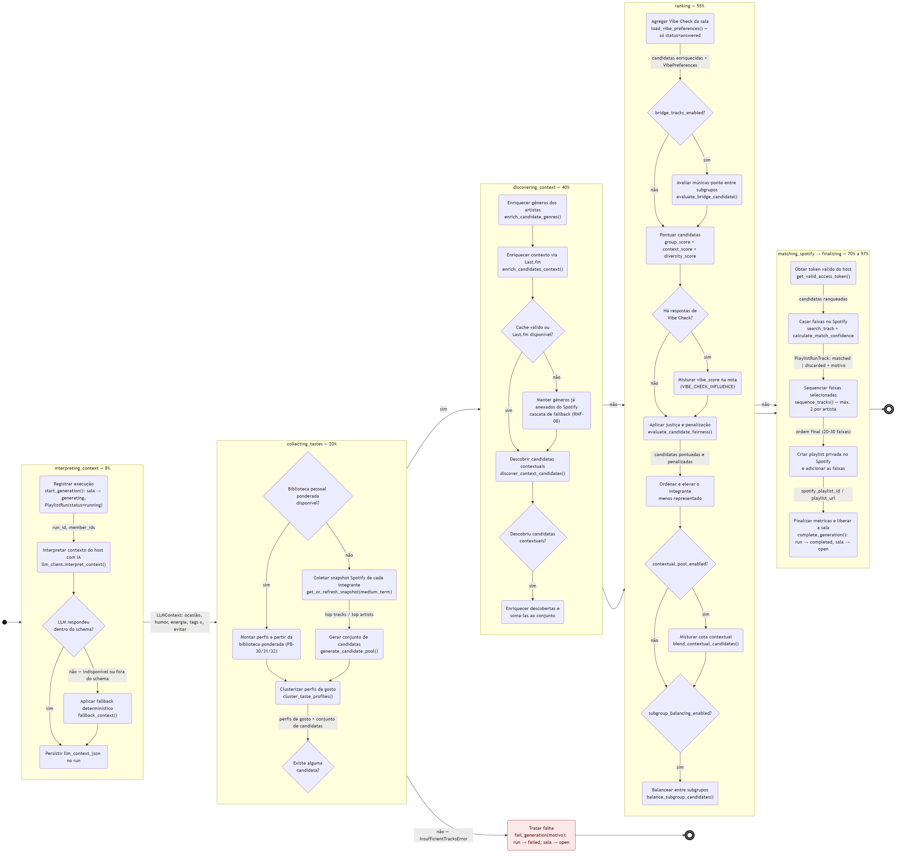

# 01 — Atividades: pipeline de geração da playlist (UC-09)

```mermaid
flowchart LR
    INICIO(( ))

    subgraph F1["interpreting_context — 8%"]
        direction TB
        A01("Registrar execução<br/>start_generation(): sala → generating,<br/>PlaylistRun(status=running)")
        A02("Interpretar contexto do host com IA<br/>llm_client.interpret_context()")
        D01{"LLM respondeu<br/>dentro do schema?"}
        A03("Aplicar fallback determinístico<br/>fallback_context()")
        A04("Persistir llm_context_json no run")
    end

    subgraph F2["collecting_tastes — 20%"]
        direction TB
        D02{"Biblioteca pessoal ponderada<br/>disponível?"}
        A05("Montar perfis a partir da<br/>biblioteca ponderada (PB-30/31/32)")
        A06("Coletar snapshot Spotify de cada integrante<br/>get_or_refresh_snapshot(medium_term)")
        A07("Gerar conjunto de candidatas<br/>generate_candidate_pool()")
        A08("Clusterizar perfis de gosto<br/>cluster_taste_profiles()")
        D03{"Existe alguma<br/>candidata?"}
    end

    subgraph F3["discovering_context — 40%"]
        direction TB
        A09("Enriquecer gêneros dos artistas<br/>enrich_candidate_genres()")
        A10("Enriquecer contexto via Last.fm<br/>enrich_candidates_context()")
        D04{"Cache válido ou<br/>Last.fm disponível?"}
        A11("Manter gêneros já anexados do Spotify<br/>cascata de fallback (RNF-08)")
        A12("Descobrir candidatas contextuais<br/>discover_context_candidates()")
        D05{"Descobriu candidatas<br/>contextuais?"}
        A13("Enriquecer descobertas e<br/>somá-las ao conjunto")
    end

    subgraph F4["ranking — 55%"]
        direction TB
        A14("Agregar Vibe Check da sala<br/>load_vibe_preferences() — só status=answered")
        D06{"bridge_tracks_enabled?"}
        A15("Avaliar músicas-ponte entre subgrupos<br/>evaluate_bridge_candidate()")
        A16("Pontuar candidatas<br/>group_score + context_score + diversity_score")
        D07{"Há respostas de<br/>Vibe Check?"}
        A17("Misturar vibe_score na nota<br/>(VIBE_CHECK_INFLUENCE)")
        A18("Aplicar justiça e penalização<br/>evaluate_candidate_fairness()")
        A19("Ordenar e elevar o integrante<br/>menos representado")
        D08{"contextual_pool_enabled?"}
        A20("Misturar cota contextual<br/>blend_contextual_candidates()")
        D09{"subgroup_balancing_enabled?"}
        A21("Balancear entre subgrupos<br/>balance_subgroup_candidates()")
    end

    subgraph F5["matching_spotify → finalizing — 70% a 97%"]
        direction TB
        A22("Obter token válido do host<br/>get_valid_access_token()")
        A23("Casar faixas no Spotify<br/>search_track + calculate_match_confidence")
        A24("Sequenciar faixas selecionadas<br/>sequence_tracks() — máx. 2 por artista")
        A25("Criar playlist privada no Spotify<br/>e adicionar as faixas")
        A26("Finalizar métricas e liberar a sala<br/>complete_generation(): run → completed, sala → open")
    end

    AERR("Tratar falha<br/>fail_generation(motivo): run → failed, sala → open")

    FIM((("　")))
    FIMERR((("　")))

    INICIO --> A01
    A01 -->|"run_id, member_ids"| A02
    A02 --> D01
    D01 -->|"não — indisponível ou fora do schema"| A03
    D01 -->|sim| A04
    A03 --> A04
    A04 -->|"LLMContext: ocasião, humor, energia, tags ±, evitar"| D02

    D02 -->|sim| A05
    D02 -->|não| A06
    A06 -->|"top tracks / top artists"| A07
    A05 --> A08
    A07 --> A08
    A08 -->|"perfis de gosto + conjunto de candidatas"| D03

    D03 -->|"não — InsufficientTracksError"| AERR
    D03 -->|sim| A09
    A09 --> A10
    A10 --> D04
    D04 -->|não| A11
    D04 -->|sim| A12
    A11 --> A12
    A12 --> D05
    D05 -->|sim| A13
    D05 -->|não| A14
    A13 --> A14

    A14 -->|"candidatas enriquecidas + VibePreferences"| D06
    D06 -->|sim| A15
    D06 -->|não| A16
    A15 --> A16
    A16 --> D07
    D07 -->|sim| A17
    D07 -->|não| A18
    A17 --> A18
    A18 -->|"candidatas pontuadas e penalizadas"| A19
    A19 --> D08
    D08 -->|sim| A20
    D08 -->|não| D09
    A20 --> D09
    D09 -->|sim| A21
    D09 -->|não| A22
    A21 --> A22

    A22 -->|"candidatas ranqueadas"| A23
    A23 -->|"PlaylistRunTrack: matched | discarded + motivo"| A24
    A24 -->|"ordem final (20–30 faixas)"| A25
    A25 -->|"spotify_playlist_id / playlist_url"| A26
    A26 --> FIM
    AERR --> FIMERR

    classDef inicial fill:#1a1a1a,stroke:#1a1a1a,color:#1a1a1a
    classDef final fill:#ffffff,stroke:#1a1a1a,stroke-width:4px,color:#1a1a1a
    classDef erro fill:#fde8e8,stroke:#b02a2a,color:#5c1414
    class INICIO inicial
    class FIM,FIMERR final
    class AERR erro
```

Este diagrama adota a perspectiva de **modelagem dirigida a dados** do slide de Modelagem de
Sistemas: cada retângulo arredondado é uma etapa de processamento e os rótulos das setas nomeiam o
objeto de dados que flui de uma etapa para a seguinte — do `LLMContext` interpretado pela IA até as
candidatas pontuadas, ranqueadas e finalmente casadas no Spotify —, exatamente como o exemplo da
bomba de insulina anota os dados entre "obter valor do sensor", "calcular nível de glicose" e
"calcular dose". Todos os nove losangos correspondem a condicionais que existem literalmente em
`generation_service.py` e nos clientes externos: as duas cascatas de resiliência (fallback
determinístico do LLM em `llm_client.interpret_context` e a cascata do Last.fm em
`enrich_candidates_context`), as três chaves de configuração do produto (`bridge_tracks_enabled`,
`contextual_pool_enabled`, `subgroup_balancing_enabled`), a origem dos perfis
(`load_library_generation_data`), a existência de candidatas contextuais, a presença de respostas de
Vibe Check e a guarda de conjunto vazio que dispara `InsufficientTracksError`. A decisão de modelagem
menos óbvia foi **achatar em um único fluxo as etapas que o código distribui entre
`execute_generation` e `_rank_candidates`**: como um diagrama de atividades descreve fluxo de
controle e de dados, e não a troca de mensagens entre objetos do diagrama de sequência (Figura 4), as
quatro decisões internas do ranqueamento aparecem no mesmo nível das demais em vez de escondidas
dentro de uma única ação "pontuar candidatas" — o que também deixa visível que `bridge_tracks_enabled`
e `subgroup_balancing_enabled` são os pontos de variação «extend» do diagrama de casos de uso.
