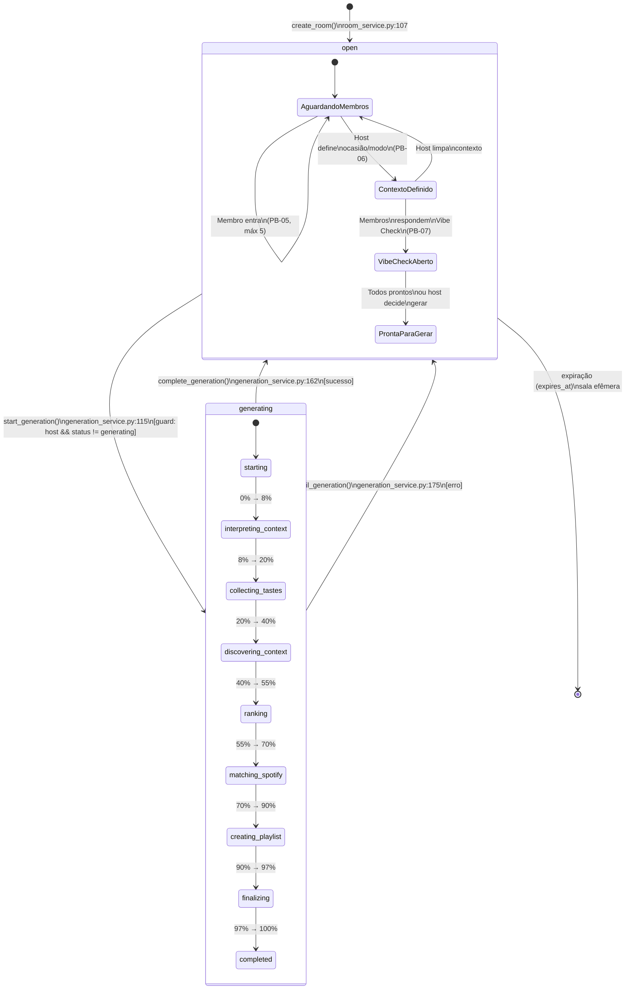

# 01 — Diagrama de Estados: MusicSession (Sala)

Este diagrama de estados modela o ciclo de vida completo de uma `MusicSession` (sala efêmera), conforme
implementado em `app/db/models.py:146-179` e `app/services/room_service.py` + `generation_service.py`.

A sala possui apenas **dois estados persistentes no banco**: `"open"` e `"generating"` — ambos
controlados pela coluna `MusicSession.status` (tipo `String(32)`, default `"open"` na linha 160 do
modelo). Os subestados dentro de `open` (aguardando membros, contexto definido, vibe check, pronta
para gerar) são **comportamentais**: não existem como valores distintos da coluna `status`, mas
emergem da combinação de dados presentes na sala (existência de `occasion`/`mode`, presença de
`VibeCheckAnswer`, quantidade de membros). Modelá-los como subestados é uma decisão de documentação
que torna explícito o ciclo que o frontend (`Room.jsx`) implementa ao navegar entre as fases do lobby.

A transição `open → generating` é protegida por dois guards explícitos no código:
(1) `room.host_user_id != host_id` lança `RoomHostRequiredError` (linha 108-109), garantindo que
somente o host inicia a geração; e (2) `room.status == "generating"` lança `GenerationConflictError`
(linha 111-112), impedindo concorrência de gerações via lock pessimista (`with_for_update()`).

O estado composto `generating` detalha os 9 estágios do pipeline registrados no dicionário
`GENERATION_STAGES` (linha 56-66 de `generation_service.py`), que controla a barra de progresso
exibida em tempo real no frontend. A monotonia do progresso é garantida pela guarda em
`update_generation_progress` (linha 140: `if next_percent < run.progress_percent: return run`),
impedindo regressão percentual caso estágios sejam atingidos fora de ordem.

Ambas as saídas de `generating` (sucesso via `complete_generation` e falha via `fail_generation`)
restauram a sala para `"open"`, permitindo que o host tente gerar novamente sem precisar recriar a
sala — um requisito explícito do PB-13 (retry pós-falha). A expiração temporal da sala
(`expires_at`, definida no momento da criação) é a única forma de destruição, consistente com o
conceito de sala efêmera do RF-02.
