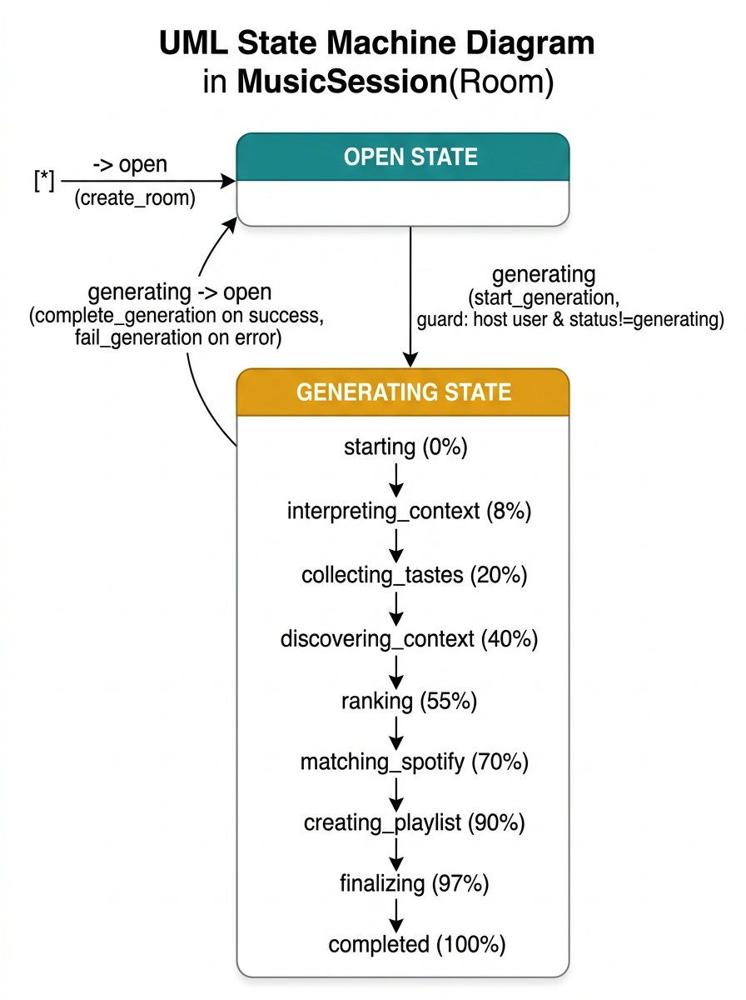
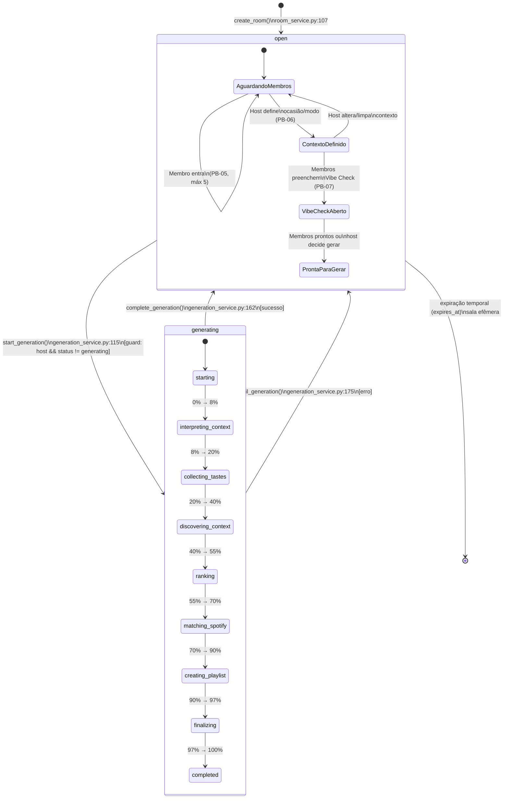

# 01 — Diagrama de Estados: MusicSession

Este diagrama modela o ciclo de vida dinâmico da entidade `MusicSession` (sala de recomendação colaborativa), conforme implementado no modelo SQLAlchemy `backend/app/db/models.py:146-179` e gerenciado pelos serviços `app/services/room_service.py` e `app/services/generation_service.py`.

### Racional de Arquitetura e Decisões de Estado

1. **Dois Estados Persistentes em Banco:**
   A coluna `MusicSession.status` (`String(32)`, default `"open"`) armazena estritamente dois valores em banco: `"open"` e `"generating"`. Os subestados comportamentais de `open` (Aguardando Membros, Contexto Definido, Vibe Check Aberto, Pronta para Gerar) são inferidos dinamicamente na aplicação e na API pelo estado dos relacionamentos (presença de membros, definição de `occasion`/`mode` e submissões em `vibe_check_answers`). Essa abstração simplifica o schema relacional mantendo a rica navegação do lobby no React frontend.

2. **Mecanismo de Lock e Guardas de Segurança (PB-13):**
   A transição de `"open"` para `"generating"` acionada por `start_generation()` executa um **lock pessimista de linha no PostgreSQL** via `.with_for_update()`. O código valida duas guardas críticas:
   - `room.host_user_id != host_id`: Lança `RoomHostRequiredError` impedindo que convidados iniciem a geração.
   - `room.status == "generating"`: Lança `GenerationConflictError` evitando execuções concorrentes simultâneas na mesma sala.

3. **Ciclo de Vida do Pipeline e Resiliência (PB-13, PB-17):**
   Enquanto em `"generating"`, a sala é blindada contra edições de membros. Ambas as saídas do pipeline — sucesso (`complete_generation`) e erro (`fail_generation`) — transicionam a sala **de volta para `"open"`**, liberando-a para novas gerações sem destruir o histórico de membros ou a sala. A expiração temporal (`expires_at`) garante a limpeza da sala efêmera.
