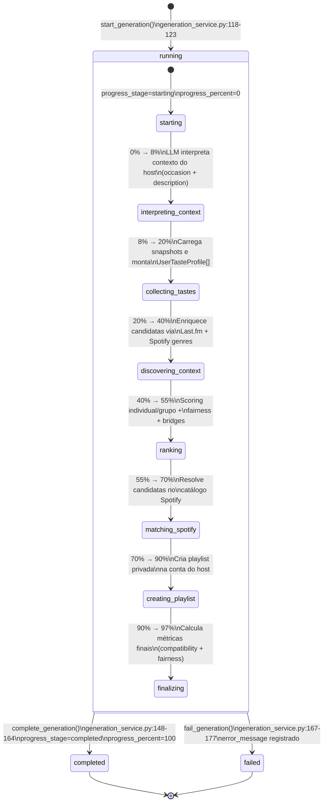

# 02 — Diagrama de Estados: PlaylistRun

Este diagrama mapeia o ciclo de vida detalhado do registro `PlaylistRun` (`app/db/models.py:482-534`), que monitora e auditoria cada tentativa de geração do motor de recomendação (PNE).

### Racional Arquitetural e Transição Monotônica de Progresso

1. **Garantia de Progresso Monotônico (PB-13):**
   A função `update_generation_progress(db, run_id, stage)` em `generation_service.py:129-145` utiliza o dicionário de estágios `GENERATION_STAGES`:
   - `starting` (0%) → `interpreting_context` (8%) → `collecting_tastes` (20%) → `discovering_context` (40%) → `ranking` (55%) → `matching_spotify` (70%) → `creating_playlist` (90%) → `finalizing` (97%) → `completed` (100%).
   A instrução `if next_percent < run.progress_percent: return run` impede regressões visuais, garantindo que o progresso da barra exibida no frontend seja estritamente não-decrescente.

2. **Categorização de Erros e Recuperação (PB-17, PB-25):**
   Caso a esteira interrompa por exceção, a função `fail_generation()` anota o erro no campo `error_message` e altera o status para `"failed"`. O bloco `except` de `execute_generation()` captura e classifica o erro em quatro motivos acionáveis no cliente:
   - `reauth_required`: Exige nova autorização OAuth no Spotify.
   - `rate_limited`: Notifica tempo de espera (`retry_after` em segundos).
   - `insufficient_tracks`: Alerta que as escolhas dos membros resultaram em candidatos insuficientes.
   - `unavailable`: Trata indisponibilidades temporárias genéricas.

3. **Imutabilidade e Registro de Histórico:**
   Cada tentativa de geração gera uma nova instância de `PlaylistRun`, mantendo o histórico de auditoria preservado para análises de satisfação e feedback pós-playlist.
