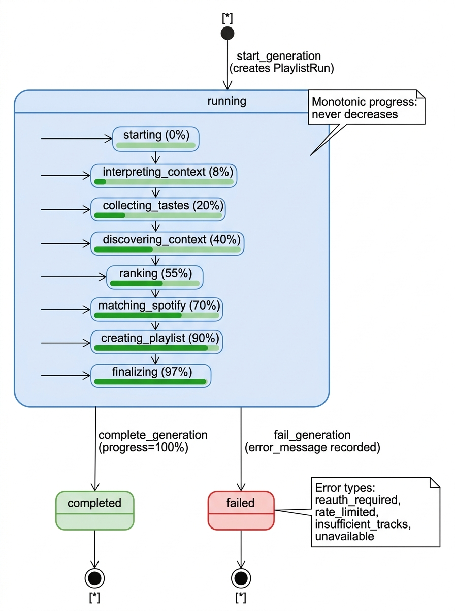
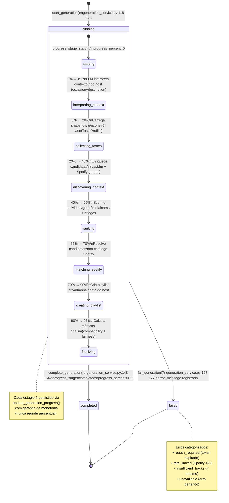

# 02 — Diagrama de Estados: PlaylistRun (Execução de Geração)

Este diagrama modela o ciclo de vida completo de um registro `PlaylistRun` conforme definido em
`app/db/models.py:482-534` e orquestrado por `app/services/generation_service.py`.

O `PlaylistRun` possui três estados terminais persistidos na coluna `status` (`String(32)`, default
`"running"`, linha 493): `"running"`, `"completed"` e `"failed"`. A criação ocorre em
`start_generation()` (linha 118-123), onde o registro nasce simultaneamente com a transição da sala
para `"generating"`, garantindo atomicidade via commit conjunto.

O estado composto `running` encapsula os **8 estágios intermediários** do pipeline, mapeados pelo
dicionário `GENERATION_STAGES` (linhas 56-66). Cada estágio corresponde a uma fase funcional do
Preference Negotiation Engine (PNE):

| Estágio | % | Camada | Arquivo principal |
|---|---:|---|---|
| `starting` | 0 | — | start_generation |
| `interpreting_context` | 8 | I/O (LLM) | llm_client.py |
| `collecting_tastes` | 20 | Engine (puro) | taste.py, candidates.py |
| `discovering_context` | 40 | I/O (Last.fm) | context_enrichment_service.py |
| `ranking` | 55 | Engine (puro) | scoring.py, fairness.py |
| `matching_spotify` | 70 | I/O (Spotify) | track_matcher.py, spotify_client.py |
| `creating_playlist` | 90 | I/O (Spotify) | spotify_client.py |
| `finalizing` | 97 | Banco | result_service.py |

A função `update_generation_progress()` (linhas 129-145) persiste cada transição com uma regra de
monotonia estrita: se `next_percent < run.progress_percent`, a atualização é ignorada (linha 140),
impedindo que operações fora de ordem causem regressão visual na barra de progresso do frontend.

A transição `running → completed` é executada por `complete_generation()` (linhas 148-164), que
além de atualizar `status` e `progress_stage`/`progress_percent`, invoca `finalize_run_metrics()`
para calcular e persistir `compatibility_score`, `fairness_score` e `explanation_json` — dados
exibidos na tela de resultado (PB-15/PB-16). A sala é restaurada para `"open"` na mesma transação.

A transição `running → failed` é executada por `fail_generation()` (linhas 167-177), que persiste
o `error_message` para diagnóstico e também restaura a sala para `"open"`, habilitando retry. O
bloco `except` de `execute_generation()` (linhas 783-811) categoriza os erros em 4 tipos:
`reauth_required` (token Spotify expirado, PB-25), `rate_limited` (HTTP 429 do Spotify, com
`retry_after` em segundos), `insufficient_tracks` (pool insuficiente após filtragem) e
`unavailable` (qualquer outro erro não mapeado). Essa categorização permite que o frontend exiba
mensagens de erro específicas e actionáveis ao host.

Não existe transição `failed → running` ou `completed → running` — cada tentativa de geração cria
um novo `PlaylistRun`. O histórico completo de tentativas (bem-sucedidas e falhadas) permanece
associado à `MusicSession` via `session_id`, permitindo auditoria.
