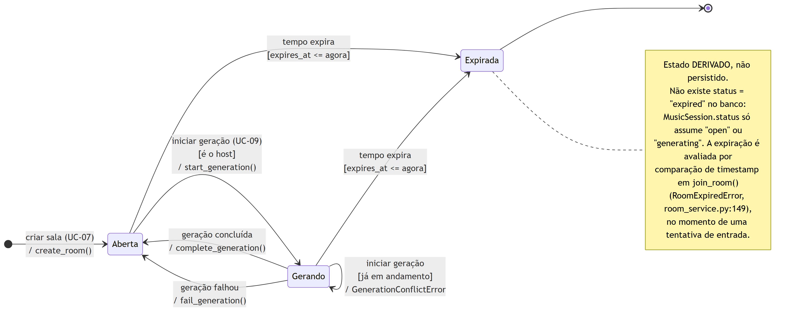
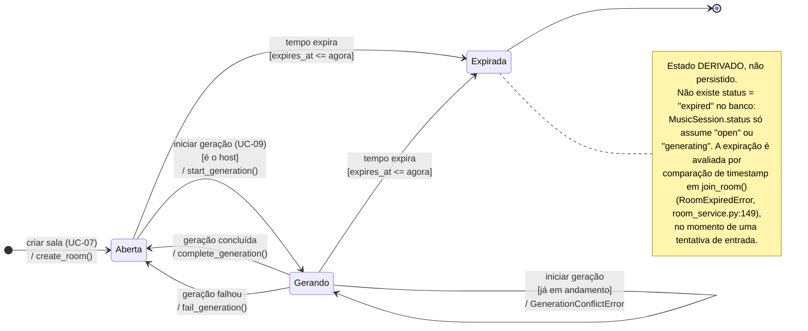

# 02 — Estados: ciclo de vida da Sala (MusicSession)

## Tabela de Estados

| Estado | Descrição |
|---|---|
| **Aberta** (`status = "open"`) | Estado inicial e de repouso da sala: aceita entrada de novos integrantes até o limite de cinco (RNF-05), permite ao host definir ocasião, descrição e modo de consenso, permite aos integrantes responder ou pular o Vibe Check, e é o único estado a partir do qual o host pode disparar uma nova geração. |
| **Gerando** (`status = "generating"`) | A sala está com uma execução do motor PNE em andamento; o `SELECT ... FOR UPDATE` em `start_generation` serializa o acesso e qualquer nova tentativa de geração é rejeitada, mas a sala continua consultável pelos integrantes por *polling*. |
| **Expirada** (derivado de `expires_at`) | A janela de 24 horas da sala terminou: novas entradas passam a ser recusadas com `RoomExpiredError`. Não corresponde a nenhum valor persistido na coluna `status` — é uma condição calculada por comparação de tempo, e por isso aparece aqui como estado terminal lógico, não como estado do banco. |

## Tabela de Eventos

| Evento | Descrição |
|---|---|
| **criar sala** | O host autenticado chama `create_room()`, que grava a sala com `status = "open"`, gera um código curto único e insere o próprio host como primeiro integrante com `role = "host"`. |
| **iniciar geração** | O host dispara `start_generation()`; sob lock pessimista, a sala passa a `"generating"` e um `PlaylistRun` com `status = "running"` é criado para registrar a execução. |
| **iniciar geração recusada [não é o host]** | Um integrante que não é o host tenta disparar a geração e recebe `RoomHostRequiredError`; a sala permanece em `"open"` sem qualquer efeito colateral. |
| **iniciar geração recusada [já há geração em andamento]** | Uma segunda tentativa de geração chega enquanto a sala está em `"generating"` e recebe `GenerationConflictError`, garantindo execução única por sala. |
| **geração concluída** | `complete_generation()` marca o run como `"completed"` com 100% de progresso, calcula as métricas de compatibilidade e justiça e devolve a sala ao estado `"open"`, liberando-a para novas gerações. |
| **geração falhou** | `fail_generation()` registra o motivo no run (`"failed"`) e também devolve a sala a `"open"`, preservando membros e histórico para que o host possa tentar novamente. |
| **tempo expira** | O relógio ultrapassa `expires_at` (criação + 24 h); na próxima tentativa de entrada, `join_room()` compara os timestamps e recusa o ingresso com `RoomExpiredError`. |

Este diagrama adota a perspectiva de **modelagem dirigida a eventos** do slide de Modelagem de
Sistemas, na notação de *statecharts*: os retângulos arredondados são os estados da `MusicSession`,
as setas rotuladas são os eventos que provocam as transições, e as duas tabelas acima replicam a
descrição tabular de Estados e Eventos que o professor usa como complemento do diagrama. A decisão
de modelagem mais delicada foi **representar "Expirada" como estado derivado e não como um valor de
`status`**: o código nunca escreve `"expired"` na coluna — a expiração é uma comparação
`expires_at <= agora` feita dentro de `join_room()` —, de modo que desenhá-la como um estado
persistido seria simplificar o schema e induzir o leitor a procurar no banco um valor que não
existe; a nota anexa ao estado registra essa distinção explicitamente. Das duas tentativas de
geração recusadas, apenas a de `GenerationConflictError` aparece como auto-transição no diagrama,
porque é a única **dependente do estado** — ela é rejeitada justamente por a sala já estar em
`"generating"`; a recusa por `RoomHostRequiredError` é uma guarda de autorização que valeria em
qualquer estado, não altera o ciclo de vida da sala e por isso fica registrada apenas na tabela de
eventos. Pelo mesmo critério de
fidelidade, o retorno de `"generating"` para `"open"` aparece como **duas transições distintas**
(`complete_generation` e `fail_generation`) em vez de uma seta genérica, porque, embora ambas
levem ao mesmo estado da sala, elas deixam o `PlaylistRun` em estados finais opostos
(`"completed"` × `"failed"`) e correspondem a caminhos de negócio diferentes.
