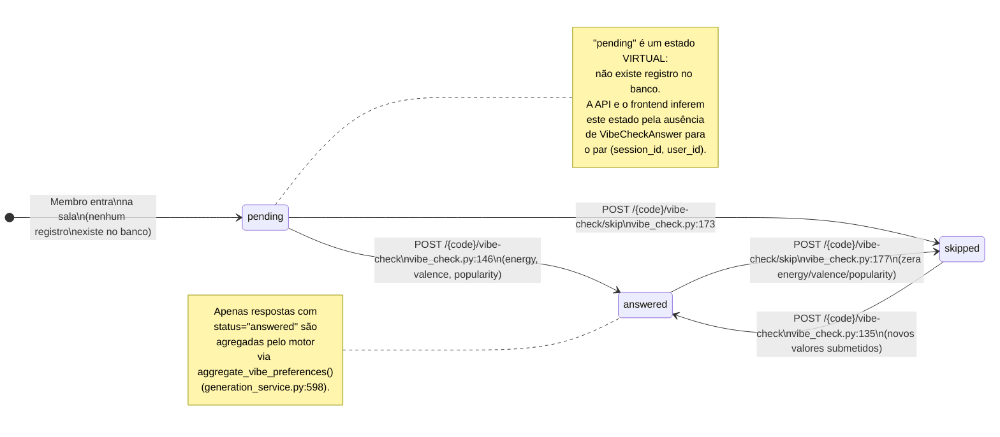

# 03 — Diagramas de Estados: VibeCheckAnswer e PlaylistRunTrack

## 3a — VibeCheckAnswer (Resposta do Vibe Check)

## 3b — PlaylistRunTrack (Faixa Candidata Resolvida)

```mermaid
stateDiagram-v2
    [*] --> Resolução : resolve_candidates()\ngeneration_service.py:180

    state Resolução {
        [*] --> matched : Spotify retorna resultado\nplayable com\nmatch_confidence ≥ 0.8\ne URI válida
        [*] --> discarded_missing : Candidata sem\nnome ou artista\n(discard_reason:\n"Missing name or artist")
        [*] --> discarded_unavailable : Candidata nativa\nnão reproduzível\n(discard_reason:\n"unavailable_in_market")
        [*] --> discarded_search_error : Erro na busca\nSpotify\n(discard_reason:\n"Spotify search error")
        [*] --> discarded_no_results : Spotify retorna\n0 resultados\n(discard_reason:\n"No results found")
        [*] --> discarded_low_confidence : Confiança abaixo\ndo limiar 0.8\n(discard_reason:\n"Confidence below\nthreshold (0.8)")
        [*] --> discarded_no_uri : Resultado sem URI\n(discard_reason:\n"no_uri")
        [*] --> discarded_unplayable : Todos os resultados\nnão reproduzíveis\n(discard_reason:\n"All results unplayable")
    }

    state PósSeleção {
        matched_selected : status=matched\n(faixa na playlist final)
        matched_artist_cap : status=discarded\n(discard_reason:\n"artist_cap")
        matched_playlist_limit : status=discarded\n(discard_reason:\n"playlist_limit")
    }

    matched --> PósSeleção : create_spotify_playlist_for_run()\n+ sequence_tracks()

    matched --> matched_selected : Selecionada pelo\nsequenciador
    matched --> matched_artist_cap : Artista excede\nlimite de 2 faixas\n(MAX_TRACKS_PER_ARTIST)
    matched --> matched_playlist_limit : Playlist excede\nlimite de 30 faixas\n(MAX_PLAYLIST_TRACKS)

    matched_selected --> [*]
    matched_artist_cap --> [*]
    matched_playlist_limit --> [*]
    discarded_missing --> [*]
    discarded_unavailable --> [*]
    discarded_search_error --> [*]
    discarded_no_results --> [*]
    discarded_low_confidence --> [*]
    discarded_no_uri --> [*]
    discarded_unplayable --> [*]
```

Este documento agrupa dois diagramas de estados menores que não justificam arquivos separados, mas são
fundamentais para entender o tratamento de dados do sistema.

### VibeCheckAnswer

A tabela `vibe_check_answers` (`app/db/models.py:653-684`) tem a coluna `status` com default
`"answered"` (linha 669) e restrição de unicidade `uq_vibe_check_session_user` por
`(session_id, user_id)`. Porém, o estado `"pending"` não existe como valor de banco — é **inferido
pela ausência de registro**: nos endpoints `GET /{code}/members-status` (`rooms.py:68`) e
`GET /{code}/vibe-check/status` (`vibe_check.py:107`), o backend verifica quais membros da sala
ainda não possuem um `VibeCheckAnswer` e retorna `"pending"` para eles. Essa decisão de design evita
criar registros desnecessários e permite distinguir "nunca acessou o Vibe Check" de "acessou e pulou".

As transições são bidirecionais entre `answered` e `skipped`: um membro pode mudar de ideia quantas
vezes quiser antes da geração ser iniciada. A transição `answered → skipped` (linha 177) zera os
campos `energy`, `valence` e `popularity` para `None`, garantindo que membros que pularam não
influenciem o cálculo de `VibePreferences` no motor — a filtragem é feita por
`VibeCheckAnswer.status == "answered"` em `load_vibe_preferences()` (linha 598 de
`generation_service.py`). Essa implementação atende ao PB-07 (Vibe Check opcional) e ao PB-29
(estado compartilhado/privado do vibe check).

### PlaylistRunTrack

A coluna `status` de `playlist_run_tracks` (`app/db/models.py:555`) aceita `"matched"` e
`"discarded"` (default `"matched"`, linha 555). O ciclo de vida de cada faixa candidata possui
**duas fases**: a **Resolução** (em `resolve_candidates()`, linhas 180-352 de
`generation_service.py`) e a **Pós-Seleção** (em `create_spotify_playlist_for_run()`, linhas
355-480).

Na fase de Resolução, cada `CandidateTrack` do motor é avaliada contra o catálogo Spotify. O
`match_confidence` é calculado por `calculate_match_confidence()` em `engine/track_matcher.py`
(linhas 30-53), usando similaridade fuzzy de strings entre título/artista da candidata e do resultado
Spotify. O limiar de aceitação é `≥ 0.8` (linha 316); abaixo disso, a faixa é descartada com o
motivo rastreável em `discard_reason`. Para candidatas nativas (que já possuem `spotify_id` do
snapshot original), o `match_confidence` é definido como `1.0` (linha 255) e a validação se resume
a verificar `is_playable`.

Na fase de Pós-Seleção, faixas previamente `"matched"` podem ser rebaixadas para `"discarded"` por
duas regras de negócio do PB-19: o limite de 2 faixas por artista (`MAX_TRACKS_PER_ARTIST`,
`discard_reason="artist_cap"`) e o limite de 30 faixas na playlist (`MAX_PLAYLIST_TRACKS`,
`discard_reason="playlist_limit"`). Ambas são aplicadas pelo sequenciador (`engine/sequencer.py`)
durante `sequence_tracks()`, que ordena as faixas por curva de energia e diversidade de artistas. O
`discard_reason` sempre registra a causa precisa da exclusão, atendendo ao critério 4 do PB-10
("toda candidata descartada deve ter motivo rastreável") e ao PB-14 (correspondência com
`match_confidence`).
