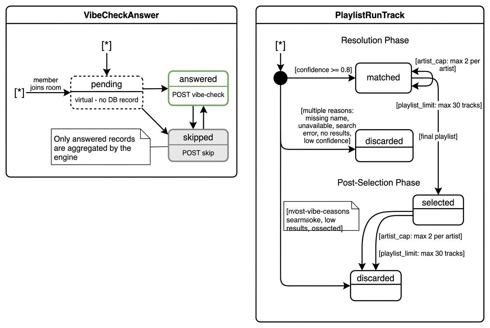
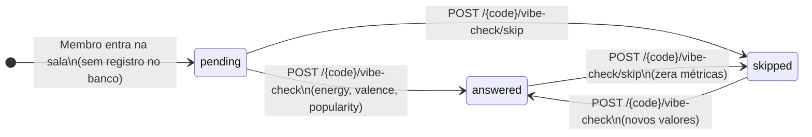
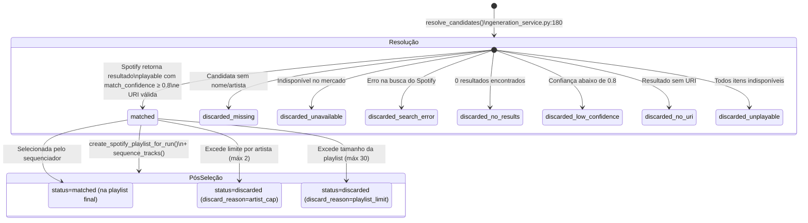

# 03 — Diagramas de Estados: VibeCheckAnswer e PlaylistRunTrack

## 3a — VibeCheckAnswer (Resposta do Vibe Check)

## 3b — PlaylistRunTrack (Faixa Candidata Resolvida)

Este documento descreve os estados operacionais das duas entidades de apoio no processo de customização e recomendação.

### Detalhamento do Racional

1. **Estado Virtual `pending` em `VibeCheckAnswer` (PB-07, PB-29):**
   Para evitar a criação de linhas nulas ou desnecessárias, a ausência de um registro `VibeCheckAnswer` para a tupla `(session_id, user_id)` é interpretada pela API e pelo frontend como o estado virtual `"pending"`. Transições entre `"answered"` e `"skipped"` permitem que os membros alterem suas opções livremente antes da geração. Respostas em `"skipped"` possuem suas métricas salvas como `None`, assegurando que `load_vibe_preferences()` filtre apenas palpites ativos (`status == "answered"`).

2. **Duas Fases de Vida em `PlaylistRunTrack` (PB-10, PB-14, PB-19):**
   - **Fase de Resolução:** `resolve_candidates()` busca a faixa na API do Spotify e calcula a pontuação de similaridade de texto (`match_confidence`). Se `match_confidence >= 0.8`, a faixa avança como `"matched"`. Caso contrário, é marcada como `"discarded"` anotando o motivo exato em `discard_reason`.
   - **Fase de Pós-Seleção:** O sequenciador (`engine/sequencer.py`) impõe as regras de negócio de finalização (teto de no máximo 2 faixas por artista e limite da playlist de 20 a 30 faixas). Faixas que excedem esses tetos são reclassificadas de `"matched"` para `"discarded"` com `discard_reason="artist_cap"` ou `"playlist_limit"`, mantendo total transparência na auditoria.
