# 04 — Diagrama de Atividade: Fluxo Completo do Usuário

```mermaid
flowchart TD
    classDef host fill:#e8f5e9,stroke:#2e7d32,stroke-width:2px,color:#000
    classDef member fill:#e3f2fd,stroke:#1565c0,stroke-width:2px,color:#000
    classDef system fill:#fff3e0,stroke:#e65100,stroke-width:2px,color:#000
    classDef external fill:#eceff1,stroke:#455a64,stroke-width:2px,color:#000
    classDef decision fill:#fce4ec,stroke:#c62828,stroke-width:2px,color:#000

    Start([Início]) --> Auth

    subgraph Autenticação ["🔐 Autenticação RF-01 / PB-02"]
        Auth["Membro clica<br/>Entrar com Spotify"]
        Auth --> OAuth["Spotify OAuth:<br/>login + consentimento"]
        OAuth --> CallbackOK{Autorizado?}
        CallbackOK -->|Não| AuthFail["Exibe erro<br/>de autorização"]
        AuthFail --> Auth
        CallbackOK -->|Sim| UpsertUser["Upsert User +<br/>SpotifyToken cifrado +<br/>AppSession"]
        UpsertUser --> Home["Tela Home<br/>Lobby Principal"]
    end

    subgraph Sala ["🏠 Criação e Entrada na Sala RF-02 / PB-04, PB-05"]
        Home --> CreateOrJoin{"Criar ou<br/>Entrar?"}
        CreateOrJoin -->|Criar| CreateRoom["Host cria sala<br/>code 6 chars,<br/>status=open"]
        CreateOrJoin -->|Entrar| JoinRoom["Membro digita<br/>código da sala"]
        CreateRoom --> RoomLobby
        JoinRoom --> JoinCheck{"Código válido?<br/>Sala aberta?<br/>Menos de 5 membros?"}
        JoinCheck -->|Não| JoinError["Exibe erro"]
        JoinError --> Home
        JoinCheck -->|Sim| AddMember["Insere<br/>MusicSessionMember<br/>role=member"]
        AddMember --> RoomLobby["Lobby da Sala<br/>lista membros em<br/>tempo real"]
    end

    subgraph Contexto ["🎯 Contexto e Vibe Check RF-03 / PB-06, PB-07"]
        RoomLobby --> SetContext["Host define ocasião,<br/>descrição e modo<br/>de consenso"]
        SetContext --> VibeCheck{"Membros<br/>respondem<br/>Vibe Check?"}
        VibeCheck -->|Responder| SubmitVibe["Submete energy,<br/>valence, popularity<br/>status=answered"]
        VibeCheck -->|Pular| SkipVibe["Pula Vibe Check<br/>status=skipped"]
        SubmitVibe --> ReadyCheck
        SkipVibe --> ReadyCheck
        ReadyCheck{"Todos prontos<br/>ou host decide<br/>gerar?"}
        ReadyCheck -->|Não| VibeCheck
    end

    subgraph Geração ["⚙️ Geração de Playlist RF-04 a RF-08 / PB-09 a PB-19"]
        ReadyCheck -->|Sim| StartGen["Host dispara geração<br/>MusicSession.status<br/>= generating"]
        StartGen --> LLM["Interpreta contexto<br/>via LLM / fallback<br/>8%"]
        LLM --> Tastes["Constrói perfis<br/>de gosto do grupo<br/>20%"]
        Tastes --> Enrich["Enriquece candidatas<br/>Last.fm + Spotify<br/>40%"]
        Enrich --> Score["Scoring +<br/>fairness + bridges<br/>55%"]
        Score --> Match["Matching no<br/>catálogo Spotify<br/>70%"]
        Match --> CreatePL["Cria playlist<br/>no perfil do host<br/>90%"]
        CreatePL --> Finalize["Calcula métricas<br/>e persiste resultado<br/>100%"]
        Finalize --> GenResult{Sucesso?}
        GenResult -->|Não| GenFail["Registra erro<br/>status=failed<br/>sala volta a open"]
        GenFail --> RoomLobby
    end

    subgraph Resultado ["📊 Resultado e Feedback RF-09 / PB-15, PB-16, PB-20"]
        GenResult -->|Sim| ResultPage["Tela de Resultado:<br/>playlist + player +<br/>compatibilidade +<br/>fairness + explicação"]
        ResultPage --> FeedbackDecision{"Membro deseja<br/>dar feedback?"}
        FeedbackDecision -->|Por faixa| TrackFeedback["Avalia faixas:<br/>liked / disliked /<br/>more_like_this /<br/>never_again"]
        FeedbackDecision -->|Geral| PlaylistFeedback["Avalia playlist:<br/>representação 0-5<br/>satisfação 0-5<br/>comentários"]
        FeedbackDecision -->|Não| End
        TrackFeedback --> PlaylistFeedback
        PlaylistFeedback --> End
    end

    End([Fim do Fluxo])

    subgraph Legenda ["Legenda de Cores"]
        L1["Verde: Ação do Host"]
        L2["Azul: Ação do Membro"]
        L3["Laranja: Processamento interno"]
        L4["Cinza: Sistema externo"]
        L5["Rosa: Decisão / Bifurcação"]
    end

    class Auth,Home,JoinRoom,SubmitVibe,SkipVibe,RoomLobby,ResultPage,TrackFeedback,PlaylistFeedback,L2 member
    class CreateRoom,SetContext,StartGen,L1 host
    class AuthFail,UpsertUser,JoinError,AddMember,Tastes,Score,Finalize,GenFail,L3 system
    class OAuth,LLM,Enrich,Match,CreatePL,L4 external
    class CallbackOK,CreateOrJoin,JoinCheck,VibeCheck,ReadyCheck,GenResult,FeedbackDecision,L5 decision
```

Este diagrama de atividade modela o fluxo completo de interação de um grupo de usuários com o Vibe
Check, desde a autenticação até o feedback pós-playlist. Ele cruza todos os módulos do sistema —
frontend (`App.jsx`, `Login.jsx`, `Home.jsx`, `Room.jsx`, `VibeCheck.jsx`, `Result.jsx`,
`Feedback.jsx`), API (`auth.py`, `rooms.py`, `vibe_check.py`, `music.py`, `feedback.py`), serviços
(`room_service.py`, `generation_service.py`, `result_service.py`, `feedback_service.py`) e
integrações externas (`spotify_client.py`, `lastfm_client.py`, `llm_client.py`) — e mapeia cada
subfluxo ao seu requisito funcional (RF-01 a RF-09) e Product Backlog (PB-02 a PB-20).

### Estrutura do fluxo

O diagrama está organizado em **5 fases**, cada uma correspondendo a um subgraph:

1. **Autenticação (RF-01/PB-02):** Fluxo OAuth 2.0 com Spotify, incluindo o caminho de erro
   (autorização negada) e o caminho feliz (upsert de `User` + `SpotifyToken` cifrado + `AppSession`).
   O frontend redireciona para a tela Home após receber o cookie `vibe_session`.

2. **Criação e Entrada na Sala (RF-02/PB-04/PB-05):** Bifurcação entre criar (host) e entrar
   (membro). A criação gera um código de 6 caracteres único (`MusicSession.code`). A entrada valida:
   existência da sala, status `"open"`, e limite de 5 membros (`MusicSessionMember` com PK composta).
   O guard de autorização (`RoomHostRequiredError`) é aplicado nas ações exclusivas do host.

3. **Contexto e Vibe Check (RF-03/PB-06/PB-07):** O host define a ocasião, descrição e modo de
   consenso (Democrático, Festa Segura ou Descoberta). Os membros podem responder ou pular o Vibe
   Check — ambas as opções são reversíveis até o momento da geração. O estado `"pending"` (virtual)
   indica que o membro ainda não interagiu com o formulário.

4. **Geração de Playlist (RF-04..RF-08/PB-09..PB-19):** O subfluxo mais complexo, que encapsula os
   8 estágios do pipeline PNE (detalhados no diagrama 02 desta pasta e no diagrama
   `visao-arquitetural/02-pipeline-dados-pne.md`). Cada estágio é codificado por cor:
   verde/laranja para processamento interno (engine puro + banco) e cinza para chamadas a sistemas
   externos (LLM, Last.fm, Spotify). O caminho de falha restaura a sala para `"open"`, permitindo
   retry imediato.

5. **Resultado e Feedback (RF-09/PB-15/PB-16/PB-20):** O membro visualiza a playlist gerada com
   player embedded do Spotify, métricas de compatibilidade e fairness, e explicação por faixa. O
   feedback é opcional e ocorre em duas granularidades: por faixa individual
   (`MemberTrackFeedback`: liked/disliked/more\_like\_this/never\_again) e por playlist global
   (`PlaylistFeedback`: notas de representação e satisfação de 0 a 5, com comentários livres).

### Decisões de modelagem

As **bifurcações (losangos rosa)** representam pontos onde o sistema avalia condições de negócio:
código válido, autorização do host, estado da sala, ou escolha explícita do usuário. Cada caminho
alternativo leva a uma recuperação (exibição de erro + retorno ao ponto anterior) ou ao avanço para
a próxima fase.

A codificação por cores distingue **quem age** em cada etapa: verde para ações exclusivas do host,
azul para ações de qualquer membro, laranja para processamento do backend, e cinza para interações
com sistemas externos. Essa distinção visual permite identificar rapidamente quais etapas são
bloqueantes (dependem de serviço externo) e quais são determinísticas (processamento local do motor).

O diagrama **não repete** os detalhes internos do pipeline PNE (já documentados nos diagramas de
estado do `PlaylistRun` e no diagrama de pipeline em `visao-arquitetural/`), apresentando-os como um
subfluxo compacto com referência cruzada. Isso evita duplicação e mantém este diagrama no nível de
abstração adequado para um diagrama de atividade de caso de uso — focado na experiência do usuário,
não nos algoritmos internos.
