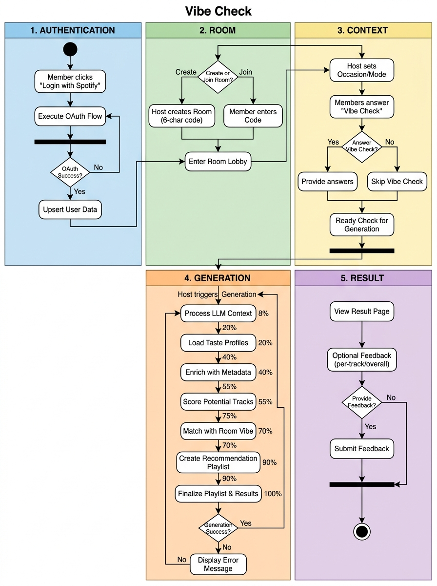

# 04 — Diagrama de Atividade: Fluxo Completo do Usuário

```mermaid
flowchart TD
    Start(["Início"]) --> Auth

    subgraph Autenticação ["🔐 Autenticação RF-01 / PB-02"]
        Auth["Membro clica<br/>Entrar com Spotify"]
        Auth --> OAuth["Spotify OAuth:<br/>login + consentimento"]
        OAuth --> CallbackOK{Autorizado?}
        CallbackOK -->|Não| AuthFail["Exibe erro<br/>de autorização"]
        AuthFail --> Auth
        CallbackOK -->|Sim| UpsertUser["Upsert User +<br/>SpotifyToken cifrado +<br/>AppSession"]
        UpsertUser --> Home["Tela Home<br/>Lobby Principal"]
    end

    subgraph Sala ["🏠 Criação e Entrada na Sala RF-02 / PB-04, PB-05"]
        Home --> CreateOrJoin{"Criar ou<br/>Entrar?"}
        CreateOrJoin -->|Criar| CreateRoom["Host cria sala<br/>code 6 chars,<br/>status=open"]
        CreateOrJoin -->|Entrar| JoinRoom["Membro digita<br/>código da sala"]
        CreateRoom --> RoomLobby
        JoinRoom --> JoinCheck{"Código válido?<br/>Sala aberta?<br/>Menos de 5 membros?"}
        JoinCheck -->|Não| JoinError["Exibe erro"]
        JoinError --> Home
        JoinCheck -->|Sim| AddMember["Insere<br/>MusicSessionMember<br/>role=member"]
        AddMember --> RoomLobby["Lobby da Sala<br/>lista membros em<br/>tempo real"]
    end

    subgraph Contexto ["🎯 Contexto e Vibe Check RF-03 / PB-06, PB-07"]
        RoomLobby --> SetContext["Host define ocasião,<br/>descrição e modo<br/>de consenso"]
        SetContext --> VibeCheck{"Membros<br/>respondem<br/>Vibe Check?"}
        VibeCheck -->|Responder| SubmitVibe["Submete energy,<br/>valence, popularity<br/>status=answered"]
        VibeCheck -->|Pular| SkipVibe["Pula Vibe Check<br/>status=skipped"]
        SubmitVibe --> ReadyCheck
        SkipVibe --> ReadyCheck
        ReadyCheck{"Todos prontos<br/>ou host decide<br/>gerar?"}
        ReadyCheck -->|Não| VibeCheck
    end

    subgraph Geração ["⚙️ Geração de Playlist RF-04 a RF-08 / PB-09 a PB-19"]
        ReadyCheck -->|Sim| StartGen["Host dispara geração<br/>MusicSession.status<br/>= generating"]
        StartGen --> LLM["Interpreta contexto<br/>via LLM / fallback<br/>8%"]
        LLM --> Tastes["Constrói perfis<br/>de gosto do grupo<br/>20%"]
        Tastes --> Enrich["Enriquece candidatas<br/>Last.fm + Spotify<br/>40%"]
        Enrich --> Score["Scoring +<br/>fairness + bridges<br/>55%"]
        Score --> Match["Matching no<br/>catálogo Spotify<br/>70%"]
        Match --> CreatePL["Cria playlist<br/>no perfil do host<br/>90%"]
        CreatePL --> Finalize["Calcula métricas<br/>e persiste resultado<br/>100%"]
        Finalize --> GenResult{Sucesso?}
        GenResult -->|Não| GenFail["Registra erro<br/>status=failed<br/>sala volta a open"]
        GenFail --> RoomLobby
    end

    subgraph Resultado ["📊 Resultado e Feedback RF-09 / PB-15, PB-16, PB-20"]
        GenResult -->|Sim| ResultPage["Tela de Resultado:<br/>playlist + player +<br/>compatibilidade +<br/>fairness + explicação"]
        ResultPage --> FeedbackDecision{"Membro deseja<br/>dar feedback?"}
        FeedbackDecision -->|Por faixa| TrackFeedback["Avalia faixas:<br/>liked / disliked /<br/>more_like_this /<br/>never_again"]
        FeedbackDecision -->|Geral| PlaylistFeedback["Avalia playlist:<br/>representação 0-5<br/>satisfação 0-5<br/>comentários"]
        FeedbackDecision -->|Não| End
        TrackFeedback --> PlaylistFeedback
        PlaylistFeedback --> End
    end

    End(["Fim do Fluxo"])

    subgraph Legenda ["Legenda de Cores"]
        L1["Verde: Ação do Host"]
        L2["Azul: Ação do Membro"]
        L3["Laranja: Processamento interno"]
        L4["Cinza: Sistema externo"]
        L5["Rosa: Decisão / Bifurcação"]
    end

    class Auth,Home,JoinRoom,SubmitVibe,SkipVibe,RoomLobby,ResultPage,TrackFeedback,PlaylistFeedback,L2 member
    class CreateRoom,SetContext,StartGen,L1 host
    class AuthFail,UpsertUser,JoinError,AddMember,Tastes,Score,Finalize,GenFail,L3 system
    class OAuth,LLM,Enrich,Match,CreatePL,L4 external
    class CallbackOK,CreateOrJoin,JoinCheck,VibeCheck,ReadyCheck,GenResult,FeedbackDecision,L5 decision
```

Este diagrama de atividade modela a jornada de ponta a ponta dos usuários na plataforma **Vibe Check**, dividida em 5 etapas bem delimitadas que cobrem da autenticação ao feedback pós-geração.

### Mapeamento das 5 Etapas do Fluxo

1. **Autenticação (RF-01 / PB-02):** Fluxo OAuth 2.0 com a API do Spotify. Trata recusa de autorização e emite cookies de sessão HTTP-only cifrados (`vibe_session`), garantindo que tokens do Spotify nunca alcancem o frontend.
2. **Criação e Entrada na Sala (RF-02 / PB-04, PB-05):** O Host gera a sala (`code` único de 6 caracteres). Membros entram digitando o código, com validações de limite de 5 integrantes e estado da sala.
3. **Definição de Contexto e Vibe Check (RF-03 / PB-06, PB-07):** O Host define a ocasião e o modo de consenso (Democrático, Festa Segura ou Descoberta). Membros respondem parâmetros de energia, valência e popularidade no Vibe Check ou optam por pular.
4. **Execução do Pipeline PNE (RF-04 a RF-08 / PB-09 a PB-19):** O motor processa os 8 estágios em background com barra de progresso em tempo real. Em caso de falha, registra o erro e libera a sala para nova tentativa (retry).
5. **Resultado e Feedback (RF-09 / PB-15, PB-16, PB-20):** Exibição da playlist criada na conta do Host com player Spotify incorporado, relatório explicativo da LLM e métricas de justiça/compatibilidade. Permite avaliações por faixa individual e nota global de satisfação da sala.
