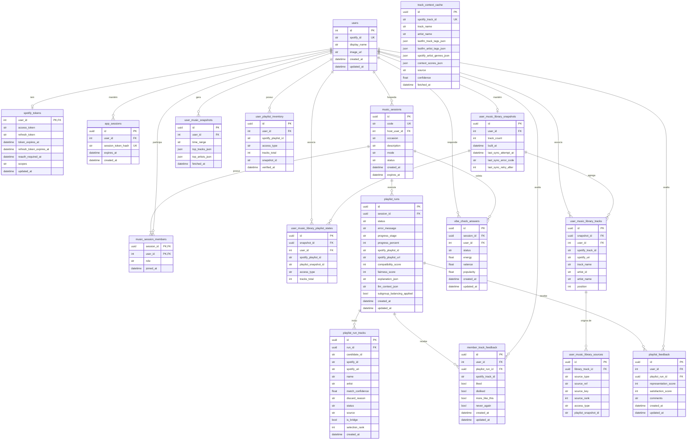

# 01 — ERD Geral Completo

Este diagrama apresenta o schema geral e completo do banco de dados relacional PostgreSQL do projeto Vibe Check, totalizando **16 tabelas**. Houve uma evolução natural das 12 tabelas originais para as 16 atuais durante a Sprint 7, onde foram incluídas as features de biblioteca musical incremental (Product Backlog PB-30 ao PB-34).

As adições contemplam as tabelas `user_playlist_inventory`, `user_music_library_snapshots`, `user_music_library_playlist_states`, `user_music_library_tracks` e `user_music_library_sources`. Juntas, elas formam um subsistema robusto de sincronização em background que armazena referências incrementais das playlists e faixas favoritas do usuário, mantendo constraints rigorosas (como `track_count 0-500` e tipos de acesso restritos a `owned` ou `collaborative`).

Vale destacar que a tabela `track_context_cache` atua como um repositório de cache totalmente independente, não possuindo chave estrangeira (FK) apontando para outras tabelas estruturais. Ela se liga logicamente às faixas através da coluna `spotify_track_id`. O uso desse design otimiza a performance das requisições a APIs externas como Last.fm e Spotify.

As constraints de unicidade, como `uq_music_snapshot_user_range` e `uq_member_track_feedback_user_run_track`, mapeiam estritamente os requisitos de não-duplicação de avaliações e de limite de snapshot temporal definidos nos requisitos. Os tipos de dados e os relacionamentos de deleção em cascata garantem a integridade relacional quando sessões expiradas ou usuários são removidos.
