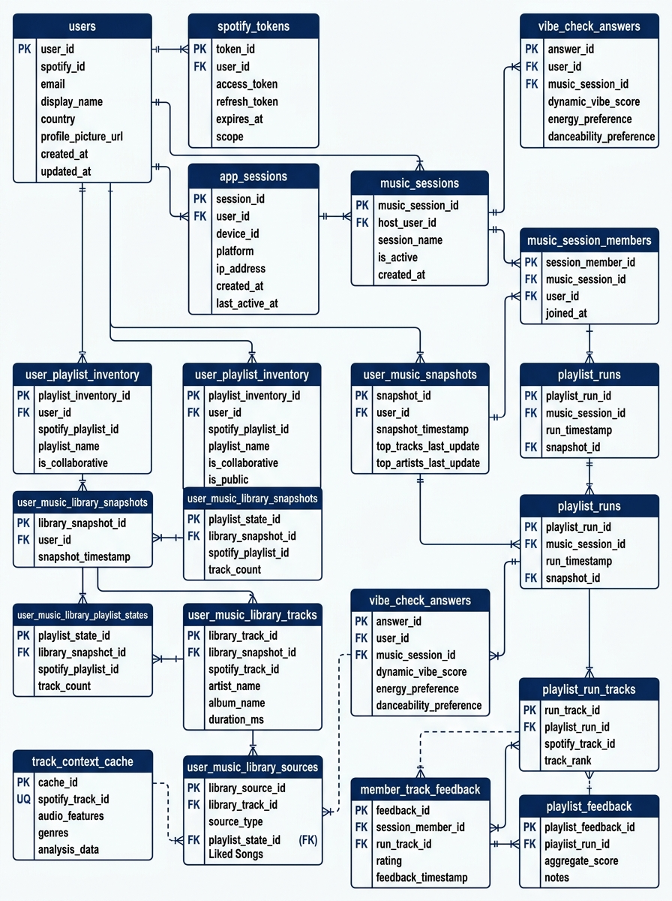

# 01 — ERD Geral Completo



```mermaid
erDiagram
    users {
        int id PK
        str spotify_id UK
        str display_name
        str image_url
        datetime created_at
        datetime updated_at
    }

    spotify_tokens {
        int user_id PK_FK
        str access_token
        str refresh_token
        datetime token_expires_at
        datetime refresh_token_expires_at
        datetime reauth_required_at
        str scopes
        datetime updated_at
    }

    app_sessions {
        uuid id PK
        int user_id FK
        str session_token_hash UK
        datetime expires_at
        datetime created_at
    }

    music_sessions {
        uuid id PK
        str code UK
        int host_user_id FK
        str occasion
        str description
        str mode
        str status
        datetime created_at
        datetime expires_at
    }

    music_session_members {
        uuid session_id PK_FK
        int user_id PK_FK
        str role
        datetime joined_at
    }

    user_music_snapshots {
        uuid id PK
        int user_id FK
        str time_range
        json top_tracks_json
        json top_artists_json
        datetime fetched_at
    }

    user_playlist_inventory {
        uuid id PK
        int user_id FK
        str spotify_playlist_id
        str access_type
        int tracks_total
        str snapshot_id
        datetime verified_at
    }

    user_music_library_snapshots {
        uuid id PK
        int user_id FK
        int track_count
        datetime built_at
        datetime last_sync_attempt_at
        str last_sync_error_code
        int last_sync_retry_after
    }

    user_music_library_playlist_states {
        uuid id PK
        uuid snapshot_id FK
        int user_id FK
        str spotify_playlist_id
        str playlist_snapshot_id
        str access_type
        int tracks_total
    }

    user_music_library_tracks {
        uuid id PK
        uuid snapshot_id FK
        int user_id FK
        str spotify_track_id
        str spotify_uri
        str track_name
        str artist_id
        str artist_name
        int position
    }

    user_music_library_sources {
        uuid id PK
        uuid library_track_id FK
        str source_type
        str source_ref
        str source_key
        int source_rank
        str access_type
        str playlist_snapshot_id
    }

    track_context_cache {
        uuid id PK
        str spotify_track_id UK
        str track_name
        str artist_name
        json lastfm_track_tags_json
        json lastfm_artist_tags_json
        json spotify_artist_genres_json
        json context_scores_json
        str source
        float confidence
        datetime fetched_at
    }

    vibe_check_answers {
        uuid id PK
        uuid session_id FK
        int user_id FK
        str status
        float energy
        float valence
        float popularity
        datetime created_at
        datetime updated_at
    }

    playlist_runs {
        uuid id PK
        uuid session_id FK
        str status
        str error_message
        str progress_stage
        int progress_percent
        str spotify_playlist_id
        str spotify_playlist_url
        int compatibility_score
        int fairness_score
        str explanation_json
        str llm_context_json
        bool subgroup_balancing_applied
        datetime created_at
        datetime updated_at
    }

    playlist_run_tracks {
        uuid id PK
        uuid run_id FK
        str candidate_id
        str spotify_id
        str spotify_uri
        str name
        str artist
        float match_confidence
        str discard_reason
        str status
        str source
        bool is_bridge
        int selection_rank
        datetime created_at
    }

    member_track_feedback {
        uuid id PK
        int user_id FK
        uuid playlist_run_id FK
        str spotify_track_id
        bool liked
        bool disliked
        bool more_like_this
        bool never_again
        datetime created_at
        datetime updated_at
    }

    playlist_feedback {
        uuid id PK
        int user_id FK
        uuid playlist_run_id FK
        int representation_score
        int satisfaction_score
        str comments
        datetime created_at
        datetime updated_at
    }

    users ||--o| spotify_tokens : "possui (1:1)"
    users ||--o{ app_sessions : "mantém (1:N)"
    users ||--o{ music_sessions : "hospeda (1:N)"
    users ||--o{ music_session_members : "participa (1:N)"
    music_sessions ||--|{ music_session_members : "agrega (1:N)"
    users ||--o{ user_music_snapshots : "gera (1:N)"
    users ||--o{ user_playlist_inventory : "possui (1:N)"
    users ||--o| user_music_library_snapshots : "mantém (1:1)"
    
    user_music_library_snapshots ||--o{ user_music_library_playlist_states : "contém (1:N)"
    users ||--o{ user_music_library_playlist_states : "associa (1:N)"
    
    user_music_library_snapshots ||--o{ user_music_library_tracks : "agrega (1:N)"
    users ||--o{ user_music_library_tracks : "associa (1:N)"
    
    user_music_library_tracks ||--o{ user_music_library_sources : "origina de (1:N)"
    
    music_sessions ||--o{ vibe_check_answers : "coleta (1:N)"
    users ||--o{ vibe_check_answers : "responde (1:N)"
    
    music_sessions ||--o{ playlist_runs : "executa (1:N)"
    playlist_runs ||--o{ playlist_run_tracks : "contém (1:N)"
    
    users ||--o{ member_track_feedback : "avalia (1:N)"
    playlist_runs ||--o{ member_track_feedback : "recebe (1:N)"
    
    users ||--o{ playlist_feedback : "avalia (1:N)"
    playlist_runs ||--o{ playlist_feedback : "recebe (1:N)"

    playlist_run_tracks ..> track_context_cache : "consulta lógica por spotify_track_id (sem FK)"
```

Este diagrama mapeia o modelo de dados relacional completo do repositório PostgreSQL no projeto **Vibe Check**, consolidando as **16 tabelas SQLAlchemy** definidas em `backend/app/db/models.py`. O modelo evoluiu de 12 tabelas para 16 tabelas durante a Sprint 7 (PB-30 a PB-34) para acomodar a sincronização incremental da biblioteca musical dos usuários.

### Organização em Subsistemas

1. **Identidade e Autenticação (RNF-01 / PB-02):**
   - `users`: Entidade central do sistema, indexada por `spotify_id` único.
   - `spotify_tokens`: Relação de composição 1:1 estrita (`user_id` como PK/FK). Armazena os segredos OAuth (`access_token`, `refresh_token`) cifrados em repouso via biblioteca Fernet (`crypto.py`), impedindo o vazamento de credenciais.
   - `app_sessions`: Gerencia sessões ativas do frontend via hash de cookie `session_token_hash` com expiração controlada.

2. **Salas e Gestão do Grupo (RF-02 / PB-04, PB-05, PB-07):**
   - `music_sessions`: Define a sala efêmera criada pelo host, identificada por um `code` alfanumérico único de 6 caracteres.
   - `music_session_members`: Tabela associativa da relação N:M entre usuários e salas, com chave primária composta (`session_id`, `user_id`) e atributo de papel (`role`: "host" ou "member").
   - `vibe_check_answers`: Registra a afinidade pontual enviada pelos participantes (energia, valência, popularidade) com unicidade por `(session_id, user_id)`.

3. **Biblioteca e Histórico Musical (RF-04 / PB-08, PB-30 a PB-34):**
   - `user_music_snapshots`: Snapshots periódicos de faixas e artistas mais ouvidos (`short_term`, `medium_term`, `long_term`).
   - `user_playlist_inventory`: Inventário de playlists do Spotify pertencentes ou colaborativas do usuário.
   - `user_music_library_snapshots`: Cabeçalho 1:1 da biblioteca sincronizada do usuário, controlando idempotência e tentativas de sincronização em background (`track_count` 0-500).
   - `user_music_library_playlist_states`, `user_music_library_tracks` e `user_music_library_sources`: Estrutura hierárquica normalizada para armazenar as faixas da biblioteca, suas origens e posições sem duplicidade.

4. **Engine PNE e Avaliação de Resultados (RF-05 a RF-09 / PB-09 a PB-20):**
   - `playlist_runs`: Registra cada execução do motor de recomendação para uma sala, monitorando o andamento (`progress_stage`, `progress_percent`), o resultado da LLM (`llm_context_json`), explicações descritivas e scores finais de compatibilidade e justiça.
   - `playlist_run_tracks`: Faixas selecionadas para a playlist com grau de confiança (`match_confidence`), estado (`matched`/`discarded`), ordem no ranking e motivo de descarte (`discard_reason`).
   - `track_context_cache`: Tabela de cache **isolada (sem chave estrangeira real)**, consultada por `spotify_track_id` para enriquecimento contextual via Last.fm/Spotify. Sua desconexão relacional impede que falhas em apagar ou atualizar a cache afetem a integridade das tabelas de negócio.
   - `member_track_feedback` e `playlist_feedback`: Coletam o feedback explícito dos usuários (reações a músicas e notas de satisfação de 0 a 5) com restrições de unicidade para evitar voto duplo.
