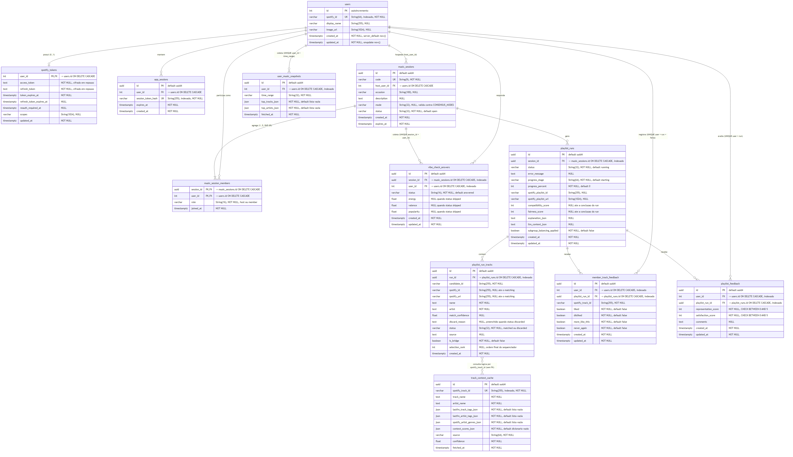

# 01 — Esquema relacional: tabelas, chaves e cardinalidades

```mermaid
erDiagram
    users {
        int id PK "autoincremento"
        varchar spotify_id UK "String(64), indexado, NOT NULL"
        varchar display_name "String(255), NULL"
        varchar image_url "String(1024), NULL"
        timestamptz created_at "NOT NULL, server_default now()"
        timestamptz updated_at "NOT NULL, onupdate now()"
    }

    spotify_tokens {
        int user_id PK,FK "-> users.id ON DELETE CASCADE"
        text access_token "NOT NULL, cifrado em repouso"
        text refresh_token "NOT NULL, cifrado em repouso"
        timestamptz token_expires_at "NOT NULL"
        timestamptz refresh_token_expires_at "NULL"
        timestamptz reauth_required_at "NULL"
        varchar scopes "String(1024), NULL"
        timestamptz updated_at "NOT NULL"
    }

    app_sessions {
        uuid id PK "default uuid4"
        int user_id FK "-> users.id ON DELETE CASCADE"
        varchar session_token_hash UK "String(255), indexado, NOT NULL"
        timestamptz expires_at "NOT NULL"
        timestamptz created_at "NOT NULL"
    }

    music_sessions {
        uuid id PK "default uuid4"
        varchar code UK "String(9), NOT NULL"
        int host_user_id FK "-> users.id ON DELETE CASCADE"
        varchar occasion "String(100), NULL"
        text description "NULL"
        varchar mode "String(32), NULL, valida contra CONSENSUS_MODES"
        varchar status "String(32), NOT NULL, default open"
        timestamptz created_at "NOT NULL"
        timestamptz expires_at "NOT NULL"
    }

    music_session_members {
        uuid session_id PK,FK "-> music_sessions.id ON DELETE CASCADE"
        int user_id PK,FK "-> users.id ON DELETE CASCADE"
        varchar role "String(16), NOT NULL, host ou member"
        timestamptz joined_at "NOT NULL"
    }

    user_music_snapshots {
        uuid id PK "default uuid4"
        int user_id FK "-> users.id ON DELETE CASCADE, indexado"
        varchar time_range "String(32), NOT NULL"
        json top_tracks_json "NOT NULL, default lista vazia"
        json top_artists_json "NOT NULL, default lista vazia"
        timestamptz fetched_at "NOT NULL"
    }

    vibe_check_answers {
        uuid id PK "default uuid4"
        uuid session_id FK "-> music_sessions.id ON DELETE CASCADE, indexado"
        int user_id FK "-> users.id ON DELETE CASCADE, indexado"
        varchar status "String(16), NOT NULL, default answered"
        float energy "NULL quando status skipped"
        float valence "NULL quando status skipped"
        float popularity "NULL quando status skipped"
        timestamptz created_at "NOT NULL"
        timestamptz updated_at "NOT NULL"
    }

    playlist_runs {
        uuid id PK "default uuid4"
        uuid session_id FK "-> music_sessions.id ON DELETE CASCADE, indexado"
        varchar status "String(32), NOT NULL, default running"
        text error_message "NULL"
        varchar progress_stage "String(64), NOT NULL, default starting"
        int progress_percent "NOT NULL, default 0"
        varchar spotify_playlist_id "String(255), NULL"
        varchar spotify_playlist_url "String(1024), NULL"
        int compatibility_score "NULL ate a conclusao do run"
        int fairness_score "NULL ate a conclusao do run"
        text explanation_json "NULL"
        text llm_context_json "NULL"
        boolean subgroup_balancing_applied "NOT NULL, default false"
        timestamptz created_at "NOT NULL"
        timestamptz updated_at "NOT NULL"
    }

    playlist_run_tracks {
        uuid id PK "default uuid4"
        uuid run_id FK "-> playlist_runs.id ON DELETE CASCADE, indexado"
        varchar candidate_id "String(255), NOT NULL"
        varchar spotify_id "String(255), NULL ate o matching"
        varchar spotify_uri "String(255), NULL ate o matching"
        text name "NOT NULL"
        text artist "NOT NULL"
        float match_confidence "NULL"
        text discard_reason "NULL, preenchido quando status discarded"
        varchar status "String(32), NOT NULL, matched ou discarded"
        text source "NULL"
        boolean is_bridge "NOT NULL, default false"
        int selection_rank "NULL, ordem final do sequenciador"
        timestamptz created_at "NOT NULL"
    }

    track_context_cache {
        uuid id PK "default uuid4"
        varchar spotify_track_id UK "String(255), indexado, NOT NULL"
        text track_name "NOT NULL"
        text artist_name "NOT NULL"
        json lastfm_track_tags_json "NOT NULL, default lista vazia"
        json lastfm_artist_tags_json "NOT NULL, default lista vazia"
        json spotify_artist_genres_json "NOT NULL, default lista vazia"
        json context_scores_json "NOT NULL, default dicionario vazio"
        varchar source "String(64), NOT NULL"
        float confidence "NOT NULL"
        timestamptz fetched_at "NOT NULL"
    }

    member_track_feedback {
        uuid id PK "default uuid4"
        int user_id FK "-> users.id ON DELETE CASCADE, indexado"
        uuid playlist_run_id FK "-> playlist_runs.id ON DELETE CASCADE, indexado"
        varchar spotify_track_id "String(255), NOT NULL"
        boolean liked "NOT NULL, default false"
        boolean disliked "NOT NULL, default false"
        boolean more_like_this "NOT NULL, default false"
        boolean never_again "NOT NULL, default false"
        timestamptz created_at "NOT NULL"
        timestamptz updated_at "NOT NULL"
    }

    playlist_feedback {
        uuid id PK "default uuid4"
        int user_id FK "-> users.id ON DELETE CASCADE, indexado"
        uuid playlist_run_id FK "-> playlist_runs.id ON DELETE CASCADE, indexado"
        int representation_score "NOT NULL, CHECK BETWEEN 0 AND 5"
        int satisfaction_score "NOT NULL, CHECK BETWEEN 0 AND 5"
        text comments "NULL"
        timestamptz created_at "NOT NULL"
        timestamptz updated_at "NOT NULL"
    }

    users            ||--o| spotify_tokens        : "possui (0..1)"
    users            ||--o{ app_sessions          : "mantem"
    users            ||--o{ music_sessions        : "hospeda (host_user_id)"
    users            ||--o{ music_session_members : "participa como"
    users            ||--o{ user_music_snapshots  : "coleta (UNIQUE user_id + time_range)"
    users            ||--o{ vibe_check_answers    : "responde"
    users            ||--o{ member_track_feedback : "registra (UNIQUE user + run + faixa)"
    users            ||--o{ playlist_feedback     : "avalia (UNIQUE user + run)"

    music_sessions   ||--|{ music_session_members : "agrega (1..5, RNF-05)"
    music_sessions   ||--o{ vibe_check_answers    : "coleta (UNIQUE session_id + user_id)"
    music_sessions   ||--o{ playlist_runs         : "gera"

    playlist_runs    ||--o{ playlist_run_tracks   : "contem"
    playlist_runs    ||--o{ member_track_feedback : "recebe"
    playlist_runs    ||--o{ playlist_feedback     : "recebe"

    playlist_run_tracks }o..o{ track_context_cache : "consulta logica por spotify_track_id (sem FK)"
```

Este diagrama apresenta, no nível físico/relacional, exatamente a mesma "estrutura dos dados
processados" que a Figura 6 (`diagrams/arquitetura/01-dominio-sala-usuario.md`) descreve no nível
conceitual/orientado a objetos: onde o diagrama de classes mostra entidades, atributos tipados em
Python e associações com multiplicidade, este mostra tabelas, tipos de coluna do PostgreSQL, chaves
primárias e estrangeiras declaradas e cardinalidade em notação pé-de-galinha — as duas visões
atendem à mesma *perspectiva estrutural* da modelagem de sistemas, que trata da organização do
sistema e da estrutura dos dados que ele processa, e por isso se complementam em vez de se
duplicarem. `music_session_members` aparece como entidade associativa de fato, e não como uma
relação N:N implícita, porque a tabela tem chave primária composta (`session_id`, `user_id`) e
carrega o atributo `role` ("host"/"member") que distingue o anfitrião dos demais integrantes; a
cardinalidade `||--|{` reproduz o piso de um integrante (o próprio host, inserido na criação da
sala), enquanto o teto de cinco do RNF-05 é uma regra de aplicação validada em `room_service.py`
sob `SELECT ... FOR UPDATE`, não um constraint declarativo do schema — daí a anotação "1..5" no
rótulo. `track_context_cache` é ligada a `playlist_run_tracks` por uma linha tracejada não
identificadora (`}o..o{`) justamente porque **não existe chave estrangeira entre as duas**: no
código ela é uma tabela de cache independente, consultada por `spotify_track_id`, e representá-la
com FK sugeriria uma integridade referencial que o banco não impõe. Por fim, a existência de um
esquema relacional formal e versionado por migrações Alembic é o que torna viável o RNF-11
(PostgreSQL em produção, SQLite nos testes automatizados): as mesmas definições declarativas de
`app/db/models.py` geram os dois bancos, e o diagrama acima é a leitura direta dessas definições.
