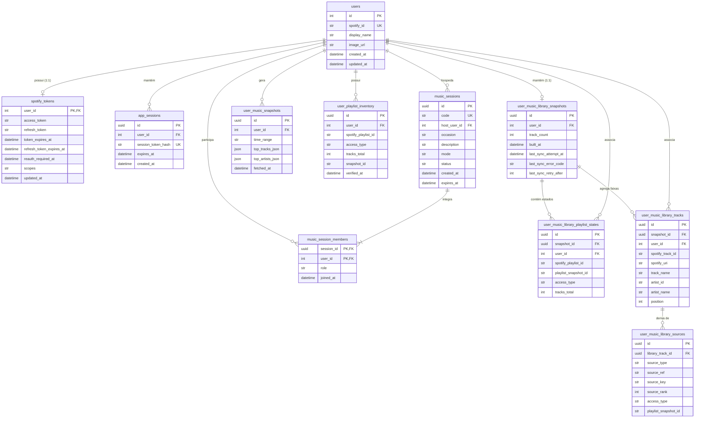

# 02 — Núcleo de Usuário, Sessão e Biblioteca

Este diagrama detalha o subconjunto de tabelas responsável pela gestão do ciclo de vida do usuário, sessões do aplicativo e o gerenciamento de salas (grupos) e biblioteca musical pessoal.

A relação de composição entre `users` e `spotify_tokens` é estritamente 1:1, modelada com o comportamento de `cascade="all, delete-orphan"`, garantindo que não haja tokens órfãos caso o usuário seja deletado. Esse modelo atende ao RF-01 e PB-02 de autenticação de conta via Spotify.

Para a formação dos grupos, a associação (N:M) entre `users` e `music_sessions` é reificada na tabela associativa `music_session_members`. Esta possui uma **Chave Primária Composta** (`session_id`, `user_id`) que não só impede duplicidade de inscrições em uma mesma sala, como embute o atributo `role` ("host" ou "guest") e atende diretamente ao RF-02, PB-04 e PB-05 (criação e acesso às salas de recomendação).

A hierarquia da biblioteca (PB-30 a PB-34) reflete uma complexa engenharia de dados offline. Ela inicia no `user_music_library_snapshots` (limitada a 1:1 com o usuário, com exclusão em cascata). Dali derivam os estados de playlist (`user_music_library_playlist_states`) e os rastreios de música (`user_music_library_tracks`), garantindo idempotência durante a sincronização incremental da biblioteca. A rastreabilidade das origens se dá em `user_music_library_sources`.

Os dados obedecem a **UniqueConstraints** (como a de usuário e `time_range` em `user_music_snapshots` para RF-04/PB-08) e **CheckConstraints** rigorosas de validação de domínio. Por exemplo: limites de 0 a 500 no `track_count`, checagem de tipos de acesso a playlists em inventário (`access_type IN ('owned', 'collaborative')`), e ranqueamentos positivos (`position >= 1`).
