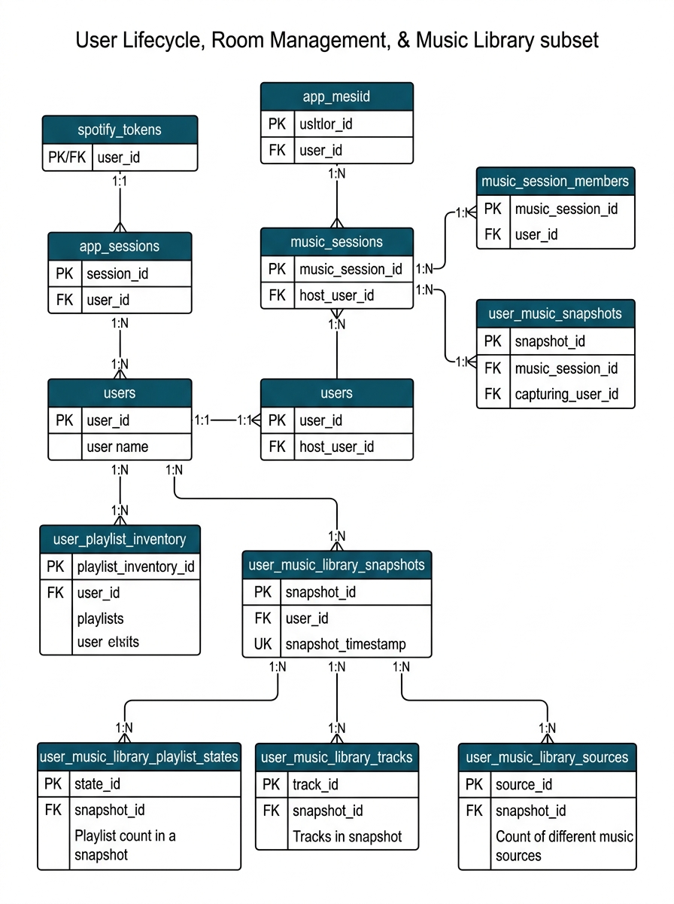

# 02 — Núcleo de Usuário, Sessão e Biblioteca



```mermaid
erDiagram
    users {
        int id PK
        str spotify_id UK
        str display_name
        str image_url
        datetime created_at
        datetime updated_at
    }

    spotify_tokens {
        int user_id PK_FK
        str access_token
        str refresh_token
        datetime token_expires_at
        datetime refresh_token_expires_at
        datetime reauth_required_at
        str scopes
        datetime updated_at
    }

    app_sessions {
        uuid id PK
        int user_id FK
        str session_token_hash UK
        datetime expires_at
        datetime created_at
    }

    music_sessions {
        uuid id PK
        str code UK
        int host_user_id FK
        str occasion
        str description
        str mode
        str status
        datetime created_at
        datetime expires_at
    }

    music_session_members {
        uuid session_id PK_FK
        int user_id PK_FK
        str role
        datetime joined_at
    }

    user_music_snapshots {
        uuid id PK
        int user_id FK
        str time_range
        json top_tracks_json
        json top_artists_json
        datetime fetched_at
    }

    user_playlist_inventory {
        uuid id PK
        int user_id FK
        str spotify_playlist_id
        str access_type
        int tracks_total
        str snapshot_id
        datetime verified_at
    }

    user_music_library_snapshots {
        uuid id PK
        int user_id FK
        int track_count
        datetime built_at
        datetime last_sync_attempt_at
        str last_sync_error_code
        int last_sync_retry_after
    }

    user_music_library_playlist_states {
        uuid id PK
        uuid snapshot_id FK
        int user_id FK
        str spotify_playlist_id
        str playlist_snapshot_id
        str access_type
        int tracks_total
    }

    user_music_library_tracks {
        uuid id PK
        uuid snapshot_id FK
        int user_id FK
        str spotify_track_id
        str spotify_uri
        str track_name
        str artist_id
        str artist_name
        int position
    }

    user_music_library_sources {
        uuid id PK
        uuid library_track_id FK
        str source_type
        str source_ref
        str source_key
        int source_rank
        str access_type
        str playlist_snapshot_id
    }

    users ||--o| spotify_tokens : "possui (1:1)"
    users ||--o{ app_sessions : "mantém (1:N)"
    users ||--o{ music_sessions : "hospeda (1:N)"
    users ||--o{ music_session_members : "participa (1:N)"
    music_sessions ||--|{ music_session_members : "agrega (1:N)"
    
    users ||--o{ user_music_snapshots : "gera (1:N)"
    users ||--o{ user_playlist_inventory : "possui (1:N)"
    users ||--o| user_music_library_snapshots : "mantém (1:1)"
    
    user_music_library_snapshots ||--o{ user_music_library_playlist_states : "contém (1:N)"
    users ||--o{ user_music_library_playlist_states : "associa (1:N)"
    
    user_music_library_snapshots ||--o{ user_music_library_tracks : "agrega (1:N)"
    users ||--o{ user_music_library_tracks : "associa (1:N)"
    
    user_music_library_tracks ||--o{ user_music_library_sources : "origina de (1:N)"
```

Este diagrama enfoca o núcleo relacional encarregado da **gestão de identidade, controle de sessões do aplicativo, salas colaborativas e sincronização da biblioteca de músicas do usuário**.

### Racional Arquitetural e Mapeamento de Código

1. **Composição Estrita Usuário → Token (RF-01 / PB-02):**
   A entidade `spotify_tokens` utiliza a chave primária do próprio usuário (`user_id` como PK e FK simultaneamente), forçando uma relação de composição 1:1 rigorosa com a regra de exclusão `cascade="all, delete-orphan"`. Isso garante que credenciais cifradas nunca fiquem órfãs caso um usuário encerre sua conta. Os tokens são renovados automaticamente por `spotify_client.py` quando `token_expires_at` é atingido.

2. **Reificação N:M da Sala de Música (RF-02 / PB-04, PB-05):**
   A participação de usuários em salas não é uma tabela associativa simples. `music_session_members` possui uma **Chave Primária Composta** (`session_id`, `user_id`) e adiciona a coluna `role` ("host" ou "member"). Essa modelagem evita duplicidade de membros na mesma sala, impõe o limite máximo de 5 participantes via regra de aplicação e distingue o criador da sala (anfitrião com permissão de disparar a geração) dos convidados.

3. **Arquitetura da Biblioteca Incremental (PB-30 ao PB-34):**
   A sincronização em segundo plano das músicas do usuário é estruturada de forma hierárquica e idempotente:
   - `user_music_library_snapshots` atua como a raiz da biblioteca de cada usuário (relação 1:1), monitorando estatísticas como `track_count` (0 a 500 faixas) e metadados de tentativas de sync em caso de rate limit.
   - `user_music_library_playlist_states` e `user_music_library_tracks` registram a fotografia atual das playlists e faixas indexadas.
   - `user_music_library_sources` mantém o rastreio da origem de cada faixa (se veio dos "Top Tracks" do Spotify ou de uma playlist específica do inventário).

4. **Integridade e Constraints de Domínio:**
   O schema SQLAlchemy aplica `UniqueConstraint` compostas como `uq_music_snapshot_user_range` em `user_music_snapshots` por `(user_id, time_range)`, e `CheckConstraint` restritivas como `access_type IN ('owned', 'collaborative')` em `user_playlist_inventory`, assegurando a qualidade dos dados antes do processamento pela Engine.
