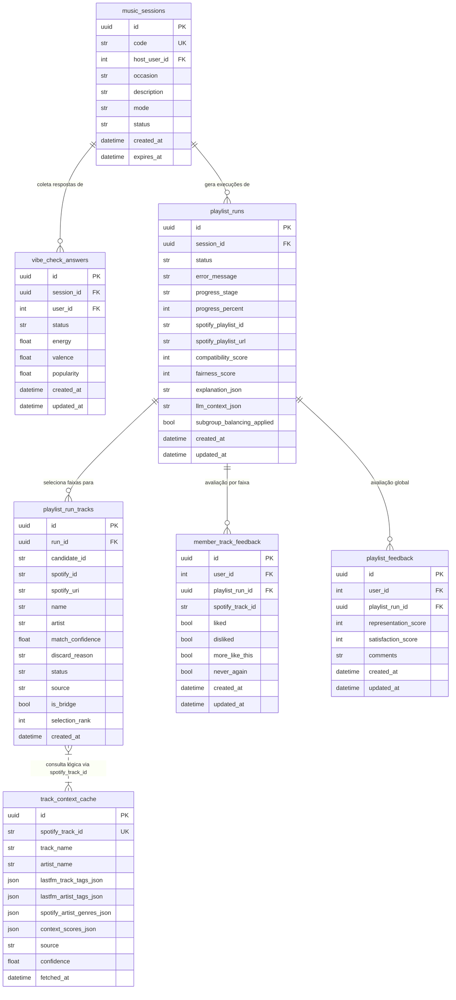

# 03 — Geração de Playlist e Feedback

Este diagrama enfoca a porção do sistema encarregada pela inteligência de recomendação, ciclo de geração de playlist e a retroalimentação de seus usuários.

O modelo central, `playlist_runs`, orquestra o ciclo de vida e andamento das gerações do motor de recomendação. A tabela é desenhada para acomodar estados de falha, execução ou sucesso (`status`: running, completed, failed), possuindo também rastreio da progressão via `progress_stage` e `progress_percent`. O registro consolida os relatórios descritivos da LLM (`explanation_json` e `llm_context_json`) que viabilizam o RF-05, RF-06 e as PBs atreladas à geração (PB-09 ao PB-17).

As faixas vinculadas a esta execução (`playlist_run_tracks`) realizam consultas à tabela de cache `track_context_cache`. É fundamental observar no diagrama o uso da relação pontilhada: isso representa uma busca lógica baseada no identificador `spotify_track_id` sem aplicar chave estrangeira (FK) real, visto que `track_context_cache` atua como cache independente para os dados enriquecidos que não devem falhar integridade por ações noutras tabelas.

A etapa final do domínio abrange as instâncias de feedback explícito, rastreadas em `member_track_feedback` (feedback detalhado da música) e `playlist_feedback` (satisfação da sala). Tais estruturas garantem unicidade das análises através de constraints específicas (como `uq_playlist_feedback_user_run`) que impedem duplo preenchimento do formulário. Adicionalmente, as notas (`representation_score` e `satisfaction_score`) possuem validação restrita com `CheckConstraint` exigindo valores de 0 a 5. Isto consolida inteiramente os RF-07, RF-08 e RF-09 relacionados aos resultados (PB-19) e avaliações dos membros (PB-20).
