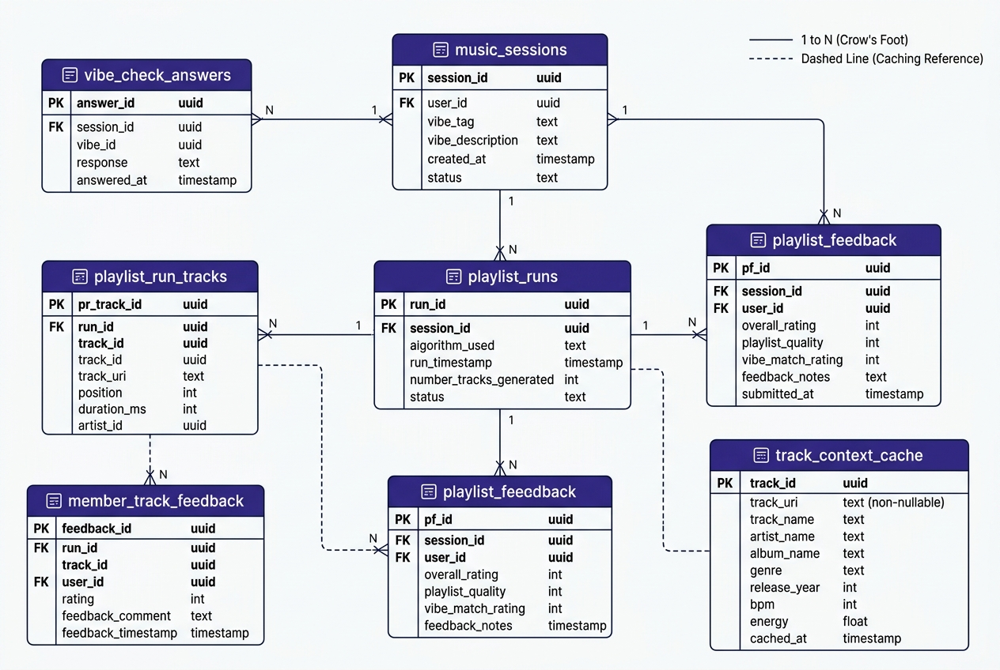

# 03 — Geração de Playlist e Feedback



```mermaid
erDiagram
    music_sessions {
        uuid id PK
        str code UK
        int host_user_id FK
        str occasion
        str description
        str mode
        str status
        datetime created_at
        datetime expires_at
    }

    vibe_check_answers {
        uuid id PK
        uuid session_id FK
        int user_id FK
        str status
        float energy
        float valence
        float popularity
        datetime created_at
        datetime updated_at
    }

    playlist_runs {
        uuid id PK
        uuid session_id FK
        str status
        str error_message
        str progress_stage
        int progress_percent
        str spotify_playlist_id
        str spotify_playlist_url
        int compatibility_score
        int fairness_score
        str explanation_json
        str llm_context_json
        bool subgroup_balancing_applied
        datetime created_at
        datetime updated_at
    }

    playlist_run_tracks {
        uuid id PK
        uuid run_id FK
        str candidate_id
        str spotify_id
        str spotify_uri
        str name
        str artist
        float match_confidence
        str discard_reason
        str status
        str source
        bool is_bridge
        int selection_rank
        datetime created_at
    }

    track_context_cache {
        uuid id PK
        str spotify_track_id UK
        str track_name
        str artist_name
        json lastfm_track_tags_json
        json lastfm_artist_tags_json
        json spotify_artist_genres_json
        json context_scores_json
        str source
        float confidence
        datetime fetched_at
    }

    member_track_feedback {
        uuid id PK
        int user_id FK
        uuid playlist_run_id FK
        str spotify_track_id
        bool liked
        bool disliked
        bool more_like_this
        bool never_again
        datetime created_at
        datetime updated_at
    }

    playlist_feedback {
        uuid id PK
        int user_id FK
        uuid playlist_run_id FK
        int representation_score
        int satisfaction_score
        str comments
        datetime created_at
        datetime updated_at
    }

    music_sessions ||--o{ vibe_check_answers : "coleta respostas (1:N)"
    music_sessions ||--o{ playlist_runs : "executa histórico (1:N)"
    playlist_runs ||--o{ playlist_run_tracks : "seleciona faixas (1:N)"
    
    playlist_runs ||--o{ member_track_feedback : "recebe avaliações por faixa (1:N)"
    playlist_runs ||--o{ playlist_feedback : "recebe avaliações gerais (1:N)"
    
    playlist_run_tracks ..> track_context_cache : "consulta lógica via spotify_track_id (sem FK)"
```

Este diagrama detalha o domínio relacional responsável pelo **ciclo de geração de recomendação (PNE), acompanhamento da execução, persistência das playlists resultantes e captura de feedback explícito**.

### Racional Arquitetural e Mapeamento de Código

1. **Orquestração da Execução em `playlist_runs` (RF-05, RF-06 / PB-09 ao PB-17):**
   A tabela `playlist_runs` armazena o estado de cada tentativa de geração vinculada a uma `MusicSession`. Ela desacopla o progresso em tempo real (`progress_stage` e `progress_percent`, de 0% a 100%) da sala, registra o relatório contextual interpretado da LLM (`llm_context_json`) e consolida os relatórios de transparência (`explanation_json`, `compatibility_score` e `fairness_score`) calculados por `result_service.py` após o término da geração.

2. **Rastreabilidade e Correspondência de Faixas em `playlist_run_tracks` (PB-10, PB-14, PB-19):**
   Cada faixa avaliada pela Engine é gravada nesta tabela. Faixas aceitas recebem `status="matched"` e `match_confidence` (grau de similaridade fuzzy entre o catálogo retornado pelo Spotify e a candidata). Faixas rejeitadas pelo filtro de artista (`MAX_TRACKS_PER_ARTIST = 2`) ou capacidade registram o motivo exato em `discard_reason` ("artist_cap", "no_uri", "confidence_below_threshold"), atendendo ao requisito de auditoria do motor.

3. **Design de Cache Independente em `track_context_cache` (RNF-08 / PB-18):**
   A relação pontilhada no diagrama destaca um aspecto crucial da arquitetura: `track_context_cache` **não possui chave estrangeira física** apontando para outras tabelas. Ela é uma tabela de cache global consultada unicamente via `spotify_track_id`. Isso isola o banco contra falhas na API do Last.fm ou Spotify — a falha em buscar tags externas grava uma cache vazia sem violar integridade relacional.

4. **Captura de Feedback Granular e Satisfação Global (RF-09 / PB-20):**
   - `member_track_feedback`: Permite a cada integrante classificar faixas individuais (`liked`, `disliked`, `more_like_this`, `never_again`) com `UniqueConstraint` por `(user_id, playlist_run_id, spotify_track_id)`.
   - `playlist_feedback`: Avalia a percepção geral da sala com notas de 0 a 5 (`representation_score`, `satisfaction_score`) validadas por `CheckConstraint` no banco (`scores BETWEEN 0 AND 5`).
