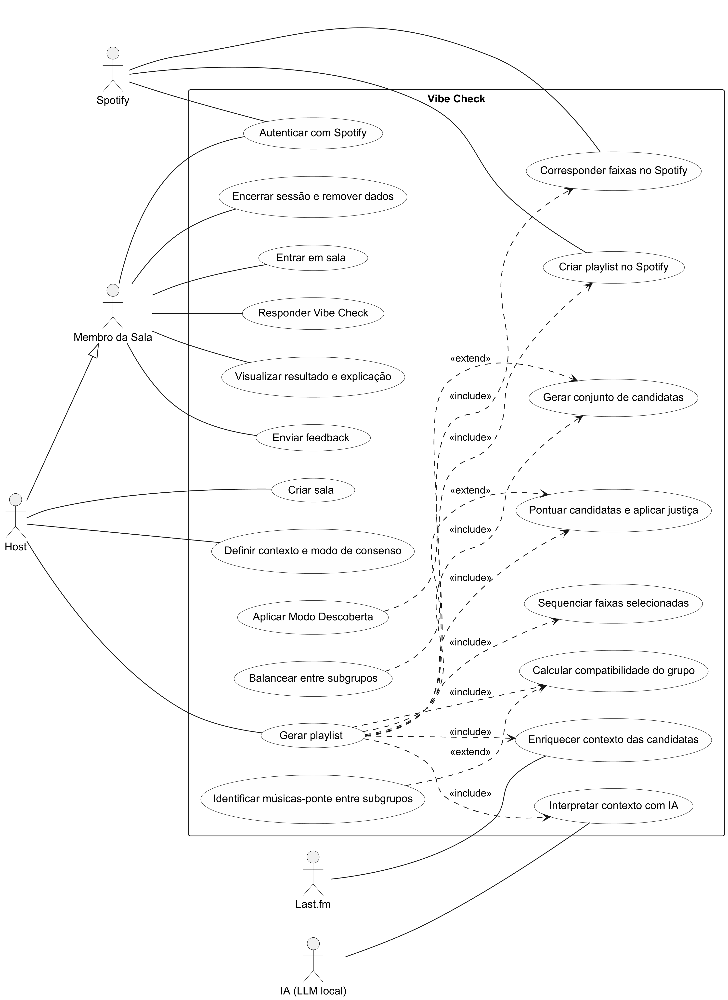
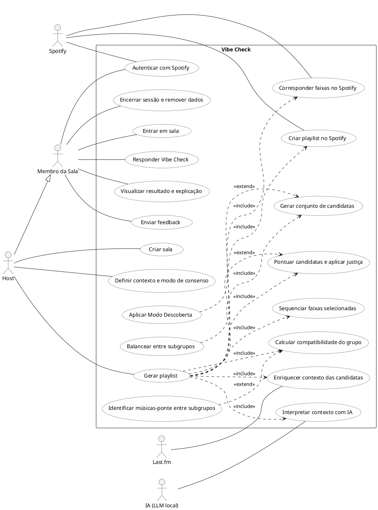

# Diagrama de Casos de Uso — Vibe Check

## Fonte PlantUML

## Decisões de modelagem

Adotamos generalização entre atores (`Host --|> Membro`) porque isso é exatamente o que o código
representa: o host é gravado como o primeiro `MusicSessionMember` da sala (com `role="host"`), então
ele herda todos os casos de uso de um membro comum (autenticar, entrar — embora não exerça este
último na prática —, responder Vibe Check, ver resultado, enviar feedback) e adiciona apenas os três
que exigem o guard `RoomHostRequiredError` no `room_service`/`generation_service`: criar sala, definir
contexto/modo e gerar playlist. As personas "Rafael" e "Lucas" do backlog não geram atores distintos
porque, no código, ambas caem no mesmo papel técnico de membro — a diferença entre elas é de
comportamento (responder vs. pular o Vibe Check), não de capacidade do sistema.

O nível de granularidade segue os RF-01 a RF-11: cada requisito funcional do documento corresponde a
um ou dois casos de uso de topo (ex.: RF-02 → "Criar sala" + "Entrar em sala"; RF-09 → "Visualizar
resultado e explicação" + "Enviar feedback"), evitando abrir um caso de uso por item do Product
Backlog. "Gerar playlist" concentra RF-05 a RF-08 como subfluxos «include» porque, em
`generation_service.execute_generation`, essas etapas (interpretar contexto, calcular
compatibilidade, gerar candidatas, enriquecer contexto, pontuar/aplicar justiça, casar faixas no
Spotify, sequenciar e criar a playlist) sempre executam nessa ordem, sem serem acionadas
independentemente por nenhum ator — não faria sentido tratá-las como casos de uso de primeiro nível.
Já RF-10 (Modo Descoberta) e RF-11 (clusterização, músicas-ponte, balanceamento) viraram «extend»
sobre os pontos do pipeline que eles alteram condicionalmente (respectivamente
`calculate_candidate_diversity_score`, `cluster_taste_profiles`/`evaluate_bridge_candidate` e
`balance_subgroup_candidates`), pois só se aplicam quando o modo/feature correspondente está
habilitado, e não fazem parte do fluxo básico do caso de uso base.

Os três sistemas externos (Spotify, Last.fm e IA local) foram modelados como atores porque
participam de interações reais e observáveis pelo sistema (chamadas HTTP/RPC saindo do backend), e
foram associados diretamente ao subfluxo específico em que atuam — Spotify em "Autenticar com
Spotify" (OAuth), "Corresponder faixas no Spotify" e "Criar playlist no Spotify"; Last.fm em
"Enriquecer contexto das candidatas"; e a IA local em "Interpretar contexto com IA" — em vez de
associá-los ao caso de uso "Gerar playlist" como um todo, o que esconderia qual etapa exatamente
depende de qual serviço externo.

Incluímos "Encerrar sessão e remover dados" como caso de uso pleno mesmo sem existir hoje um botão
correspondente no frontend (`POST /auth/logout` e `DELETE /auth/me` não são chamados por nenhuma tela
em `frontend/src`): é uma capacidade real do sistema, exigida pelo RF-01 e já validada pelo QA
(PB-03), e a ausência de um gatilho de UI é uma lacuna de integração do frontend — um detalhe de
implementação abaixo do nível de abstração deste diagrama, não uma característica ausente do sistema.
