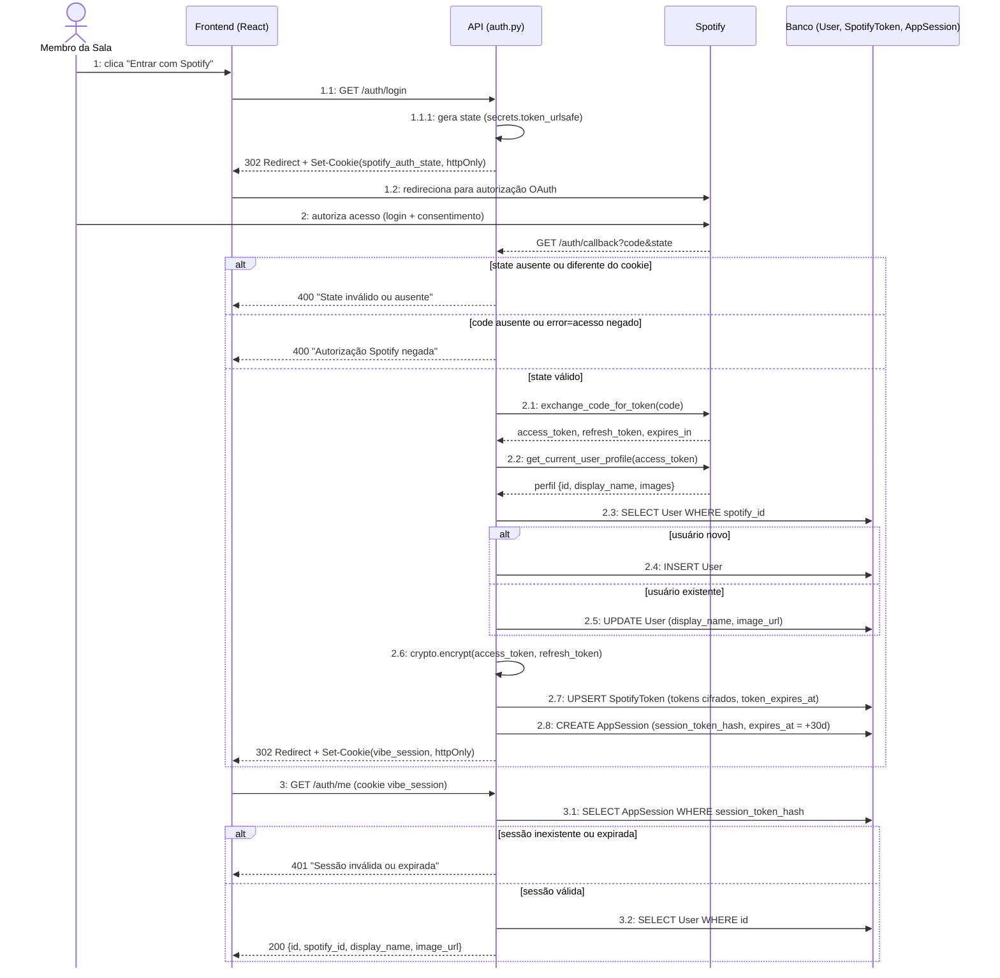

# 01 — Autenticação via Spotify OAuth

Este fluxo cobre RF-01 e é pré-requisito técnico de todo o resto do sistema — nenhum outro caso de
uso é alcançável sem uma `AppSession` válida. Foi escolhido por concentrar as três garantias de
segurança mais sensíveis do backlog (RNF-01): validação do parâmetro `state` contra CSRF, tokens
Spotify cifrados em repouso (`crypto.encrypt`) e o fato de que `access_token`/`refresh_token` nunca
saem do backend — só o `vibe_session` (hash de sessão da aplicação) chega ao navegador. O bloco `alt`
duplo no callback reflete exatamente os três desvios tratados em `auth.py` (state inválido, consentimento
negado, sucesso), e o segundo bloco `alt` mostra que `/auth/me` é a fonte única de verdade sobre a
sessão para o restante do frontend (`App.jsx` decide as rotas a partir dela).
