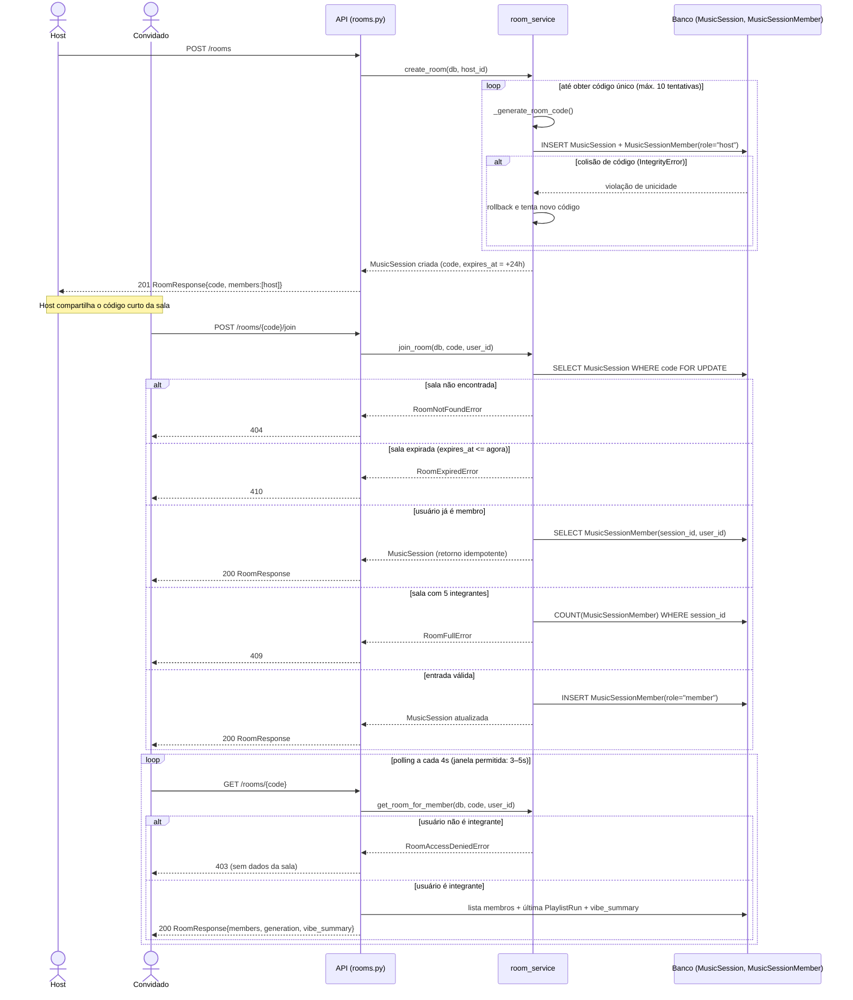

# 02 — Criação de sala e entrada de convidados

Este fluxo cobre RF-02 (PB-04/PB-05) e foi escolhido por ser o único ponto do sistema em que
concorrência real é tratada explicitamente: o `SELECT ... FOR UPDATE` em `_room_for_join_statement`
serializa entradas simultâneas na mesma sala no PostgreSQL, e o teste de mutação registrado no
`PLANO_EXECUCAO.md` comprova que, sem esse lock, o limite de cinco integrantes é violado. O `alt` com
cinco ramos reproduz fielmente as exceções de `room_service.join_room` (sala inexistente, expirada,
já-membro idempotente, sala cheia, entrada válida), e o `loop` final documenta o mecanismo de
atualização por *polling* exigido pela RNF-03 (3–5 s), que substitui WebSockets no MVP. Optamos por
mostrar `Criar sala` e `Entrar em sala` no mesmo diagrama porque, no código, ambos compartilham o
mesmo módulo (`room_service.py`) e a mesma entidade (`MusicSession`/`MusicSessionMember`), tornando a
relação entre host e convidado mais clara em uma única sequência do que em dois diagramas separados.
