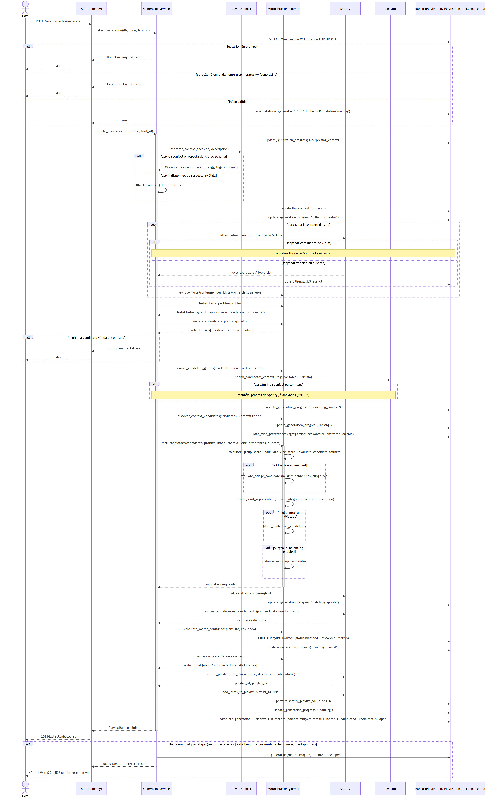
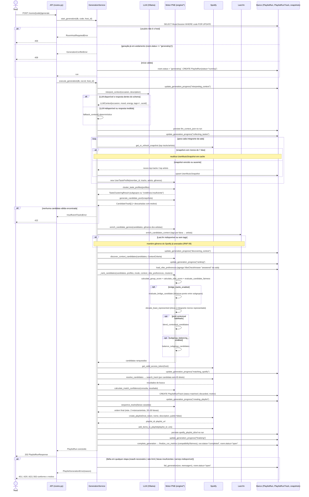

# 03 — Geração da playlist: do disparo pelo host à criação no Spotify (PNE)

Este é o fluxo mais crítico do sistema: reproduz, passo a passo, a ordem real de
`generation_service.execute_generation`, único ponto onde os quatro atores (Host, Spotify, Last.fm e
LLM) e praticamente todas as entidades do PNE interagem na mesma transação de negócio. Representamos
o motor (`engine/*`) como um único participante "PNE" — em vez de uma lifeline por módulo
(`taste`, `scoring`, `fairness`, `clustering`, `bridge`, `subgroup_balance`, `sequencer`) — porque
essas chamadas são só código puro chamado em sequência pelo `GenerationService`, sem I/O nem estado
próprio (RNF-03/RNF-04); desenhar dez lifelines internas prejudicaria a leitura sem agregar
informação nova. Os blocos `opt` (bridge tracks, pool contextual, balanceamento de subgrupos) refletem
fielmente os parâmetros booleanos de `_rank_candidates`, que só executam essas etapas quando a
configuração do produto os habilita — é a mesma lógica dos `«extend»` do diagrama de casos de uso.
O `alt` final consolida os quatro motivos de falha tratados em `execute_generation`/`rooms.py`
(reautenticação, rate limit do Spotify, faixas insuficientes e indisponibilidade genérica), cada um
mapeado para um código HTTP diferente sem nunca expor detalhes internos ao host (RNF-02).
