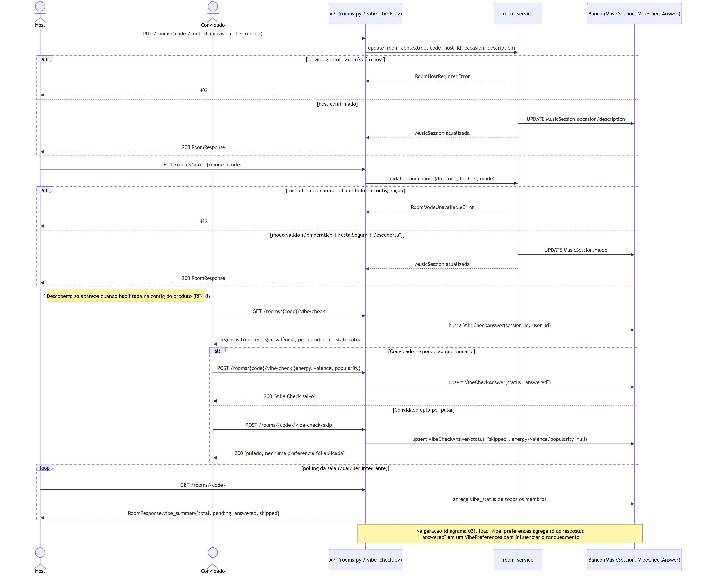
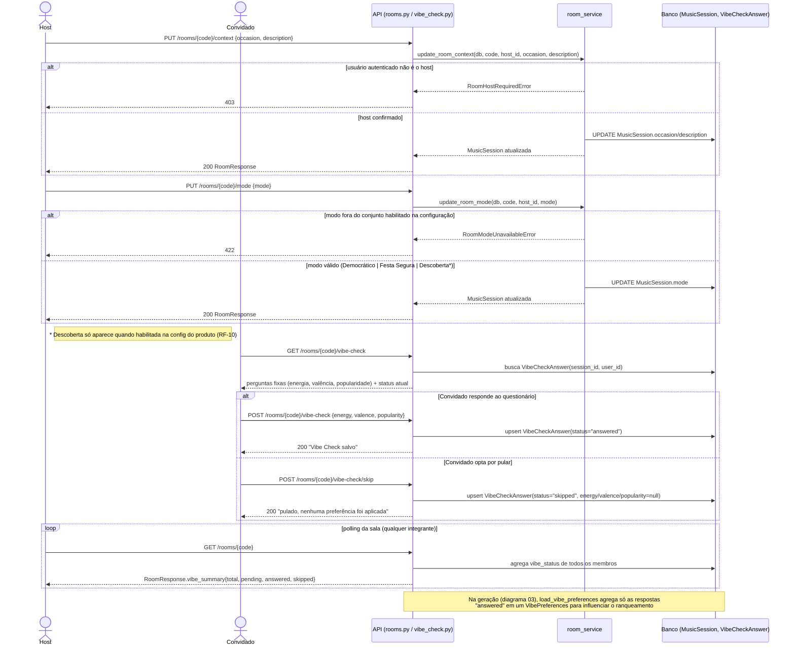

# 04 — Contexto, modo de consenso e Vibe Check

Este fluxo cobre RF-03 e foi escolhido por ser o único ponto do sistema em que host e convidado atuam
lado a lado sobre a mesma sala com autorizações opostas: `update_room_context`/`update_room_mode`
exigem `RoomHostRequiredError` para qualquer não-host, enquanto o Vibe Check é aberto a qualquer
integrante autenticado. Optamos por unir contexto/modo e Vibe Check no mesmo diagrama porque, no
código, ambos alimentam a mesma etapa futura de geração (contexto → `ContextCriteria`/LLM; Vibe Check
→ `VibePreferences`) e acontecem na mesma janela de tempo do lobby, antes do host disparar a geração.
O segundo `alt` (responder vs. pular) reproduz a exigência do backlog de que pular o questionário não
deve "fabricar preferências neutras" — no código isso aparece literalmente como
`energy/valence/popularity = None` em vez de um valor padrão como 0.5. A nota final aponta a costura
com o diagrama 03, deixando explícito que este fluxo é sempre anterior e opcional em relação à
geração, nunca bloqueante (RNF-06).
