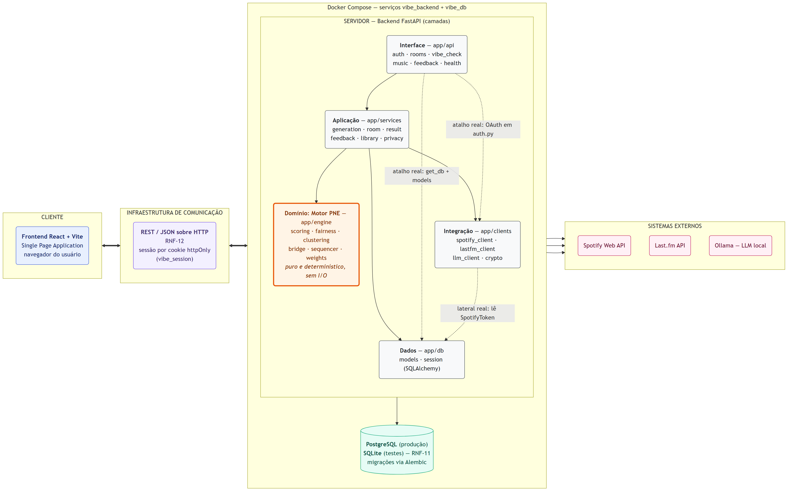
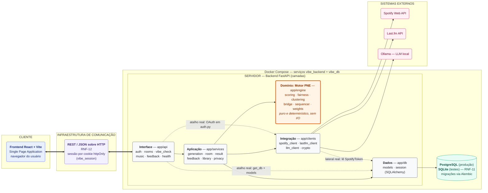

# 01 — Visão de alto nível da arquitetura

Este diagrama combina os dois estilos arquiteturais do slide 06 (Projeto Arquitetural) que o sistema
de fato implementa: **Cliente-Servidor** no eixo horizontal — o Frontend React é o cliente que
acessa, através de uma infraestrutura de comunicação REST/JSON sobre HTTP (RNF-12), o servidor
FastAPI, que por sua vez atua ele próprio como cliente dos servidores externos Spotify, Last.fm e
Ollama — e **Camadas** dentro do container do servidor, onde `app/api` → `app/services` → `app/engine`
formam a pilha principal e `app/clients` e `app/db` são as camadas de suporte que isolam,
respectivamente, o mundo externo e a persistência. A decisão de modelagem mais relevante foi
**destacar `app/engine` como camada própria e mostrá-la sem nenhuma seta de saída**: uma verificação
dos imports confirma que o motor PNE importa apenas a biblioteca padrão do Python e outros módulos do
próprio `app/engine`, sem tocar em banco, HTTP ou serviços — é essa pureza que sustenta o
determinismo e a testabilidade exigidos pelos RNF-03/RNF-04, e desenhá-la como folha da hierarquia
é o que torna a garantia visível em vez de apenas afirmada. Por honestidade com o código, as três
dependências que **violam** a regra "cada camada só depende da inferior" aparecem como setas
tracejadas em vez de omitidas: `app/api` alcança `app/db` diretamente (injeção de `get_db` e consultas
a *models* em `auth.py`, `rooms.py` e `vibe_check.py`) e `app/clients` diretamente (fluxo OAuth em
`auth.py` e `music.py`), pulando a camada de serviços, e `app/clients/spotify_client.py` lê o modelo
`SpotifyToken` de `app/db` para renovar tokens, criando uma dependência lateral entre duas camadas
irmãs. O agrupamento `Docker Compose` no diagrama cobre apenas os dois serviços do lado servidor
(`vibe_backend` e `vibe_db`); o `docker-compose.yml` declara ainda um terceiro serviço,
`vibe_frontend`, que apenas hospeda/serve o *bundle* da SPA — o cliente que efetivamente executa é o
navegador do usuário, e por isso ele aparece fora de qualquer container, do lado esquerdo da
fronteira Cliente-Servidor.
