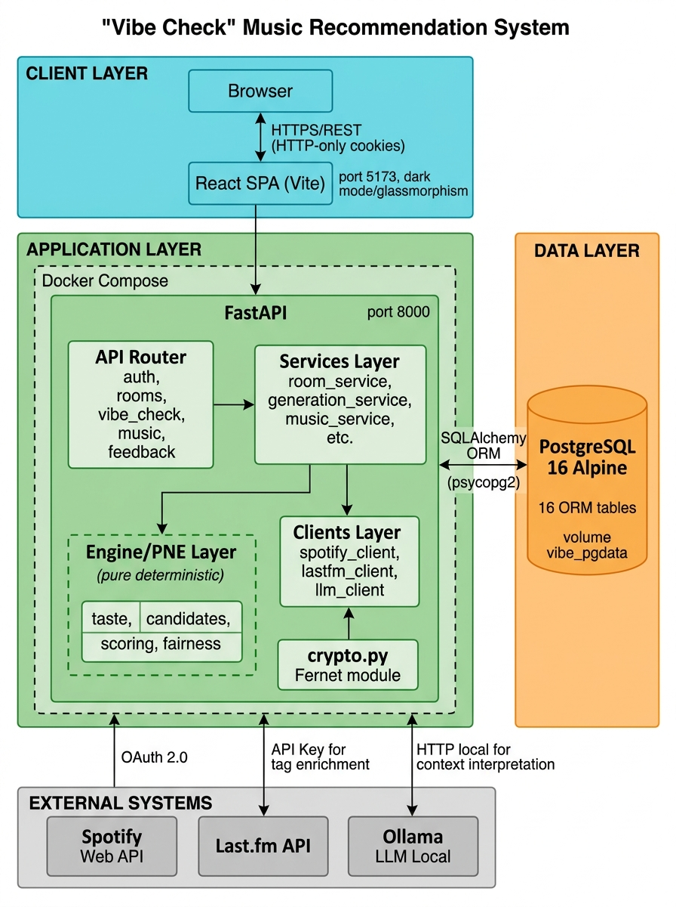
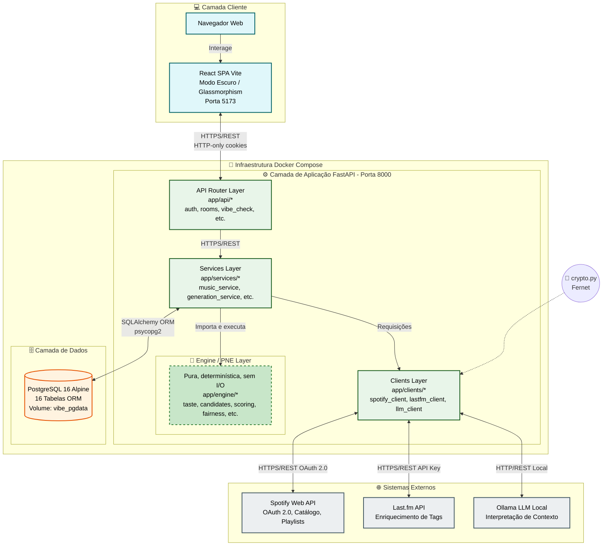

# 01 — Visão Geral do Sistema (Nível Container)

Este diagrama de contêineres (Modelo C4 Nível 2) detalha a arquitetura de alto nível do **Vibe Check**, estruturada para garantir desacoplamento, resiliência a falhas de serviços externos e estrita separação entre I/O e a inteligência pura de recomendação.

### Racional Arquitetural e Princípios de Design

1. **Isolamento e Segurança da Camada Cliente (RNF-01):**
   O frontend React (Vite) consome unicamente a camada de **API Routers** (`app/api/*`) via chamadas HTTPS/REST. Nenhuma credencial do Spotify atinge o navegador: a autenticação utiliza cookies seguros `HTTP-only` (`vibe_session`), e os tokens OAuth do Spotify permanecem mantidos no backend, cifrados em repouso com o algoritmo Fernet (`crypto.py`).

2. **Pureza do PNE (Engine Layer) (RNF-03, RNF-04):**
   A camada de domínio (`app/engine/*`) é **totalmente pura, síncrona/determinística e isenta de I/O**. Ela opera exclusivamente sobre `dataclasses` em memória (`UserTasteProfile`, `CandidateTrack`, `ContextCriteria`). A **Services Layer** (`app/services/*`) atua como a única orquestradora de I/O, responsabilizando-se por buscar dados no banco PostgreSQL e clientes externos antes de invocá-la.

3. **Estratégias de Resiliência a Serviços Externos (RNF-08, PB-17):**
   - **LLM Local (Ollama):** Interpreta o contexto da sala (`occasion`/`description`). Caso o Ollama esteja indisponível, o sistema aciona automaticamente o *fallback determinístico*, garantindo a geração da playlist.
   - **API Last.fm:** Enriquece candidatas com tags musicais. Falhas ou rate limits na API Last.fm são silenciados para não comprometer a execução principal.
   - **Spotify Client:** Gerencia renovação automática de tokens expirados e aplica exponenciação de tempo de retentativa em respostas HTTP 429.

4. **Infraestrutura em Docker Compose:**
   Orquestra os três contêineres principais (`frontend`, `backend` e `db` PostgreSQL 16 Alpine com volume persistente `vibe_pgdata`), garantindo reprodutibilidade idêntica entre ambiente local de desenvolvimento e produção.
