# 02 — Pipeline de Dados do PNE

```mermaid
flowchart TD
    Start(["Início: Host solicita geração"]) --> S1

    S1["1. Entrada e Persistência Inicial<br/>Cria PlaylistRun<br/>status=running"]
    S1 --> S2

    S2["2. Contexto LLM<br/>llm_client gera ContextCriteria<br/>fallback determinístico"]
    S2 --> S3

    S3["3. Perfis de Gosto<br/>UserMusicSnapshot → UserTasteProfile<br/>taste.py"]
    S3 --> S4

    S4["4. Compatibilidade<br/>calculate_group_compatibility<br/>taste.py"]
    S4 --> S5

    S5["5. Pool de Candidatas<br/>generate_candidate_pool<br/>candidates.py"]
    S5 --> S6

    S6["6. Clusterização<br/>cluster_taste_profiles<br/>clustering.py - se 3+ membros"]
    S6 --> S7

    S7["7. Músicas-Ponte<br/>evaluate_bridge_candidate<br/>bridge.py"]
    S7 --> S8

    S8["8. Enriquecimento Contextual<br/>TrackContextCache - Last.fm + Spotify<br/>context_enrichment_service.py"]
    S8 --> S9

    S9["9. Pool Contextual<br/>Mescla de candidatos por tags<br/>contextual_pool_service.py"]
    S9 --> S10

    S10["10. Scoring<br/>calculate_group_score - context+vibe+fairness<br/>scoring.py / fairness.py"]
    S10 --> S11

    S11["11. Balanceamento de Subgrupos<br/>balance_subgroup_candidates<br/>subgroup_balance.py"]
    S11 --> S12

    S12["12. Matching Spotify<br/>Resolve e calcula match_confidence<br/>track_matcher.py + spotify_client.py"]
    S12 --> S13

    S13["13. Sequenciamento<br/>Curva de energia e diversidade<br/>sequencer.py"]
    S13 --> S14

    S14["14. Criação da Playlist<br/>API Spotify no perfil do host<br/>spotify_client.py"]
    S14 --> S15

    S15["15. Persistência Final<br/>Salva PlaylistRunTrack<br/>status=completed"]
    S15 --> End(["Fim da Geração"])

    Fail["fail_generation<br/>Grava error_message e status=failed"]
    S1 -.-> |Em caso de falha em qualquer etapa| Fail
    S12 -.-> Fail

    classDef engine fill:#e8f5e9,stroke:#2e7d32,stroke-width:2px,color:#000
    classDef external fill:#e3f2fd,stroke:#1565c0,stroke-width:2px,color:#000
    classDef database fill:#fff3e0,stroke:#e65100,stroke-width:2px,color:#000
    classDef optional fill:#f5f5f5,stroke:#9e9e9e,stroke-width:2px,stroke-dasharray:5 5,color:#000

    class S1,S15,Fail database
    class S2,S8,S12,S14 external
    class S3,S4,S5,S10,S13 engine
    class S6,S7,S9,S11 optional
```

Este fluxograma especifica o encadeamento detalhado em 15 etapas do **Motor de Negociação de Preferências (Preference Negotiation Engine — PNE)**, coordenado pela função `execute_generation()` em `backend/app/services/generation_service.py`.

### Codificação Visual e Racional de Execução

1. **Classificação por Cores das Etapas:**
   - **Verde (Motor Puro em `app/engine/*`):** Estágios 3, 4, 5, 10 e 13. Processamento puramente em memória e imutável.
   - **Azul (I/O Externe via `app/clients/*`):** Estágios 2 (LLM), 8 (Last.fm), 12 (Spotify Matching) e 14 (Spotify Playlist Creation).
   - **Laranja (Persistência no Banco PostgreSQL):** Estágios 1 (Início do `PlaylistRun`), 15 (Conclusão e gravações de `PlaylistRunTrack`) e o nó de tratamento de erros `fail_generation`.
   - **Cinza Tracejado (Módulos Opcionais isolados por Feature Flags):** Estágios 6 (Clusterização), 7 (Músicas-Ponte), 9 (Pool Contextual por Tags) e 11 (Balanceamento de Subgrupos — PB-21 ao PB-24).

2. **Dependência Funcional de Dados:**
   A ordem das 15 etapas é estrita: a construção da Pool de Candidatas (Etapa 5) exige os Perfis de Gosto processados (Etapa 3); o Scoring (Etapa 10) exige a união do Contexto LLM (Etapa 2), respostas do Vibe Check e Enriquecimento de Tags (Etapa 8).

3. **Mecanismo Central de Falha Segura (`fail_generation`):**
   Qualquer exceção não tratada ao longo da esteira aciona o bloco `except`, invocando `fail_generation()`. O método registra a causa exata em `error_message`, transiciona `status` do `PlaylistRun` para `"failed"` e reabre a sala (`MusicSession.status = "open"`), assegurando que o estado do grupo nunca fique bloqueado.
