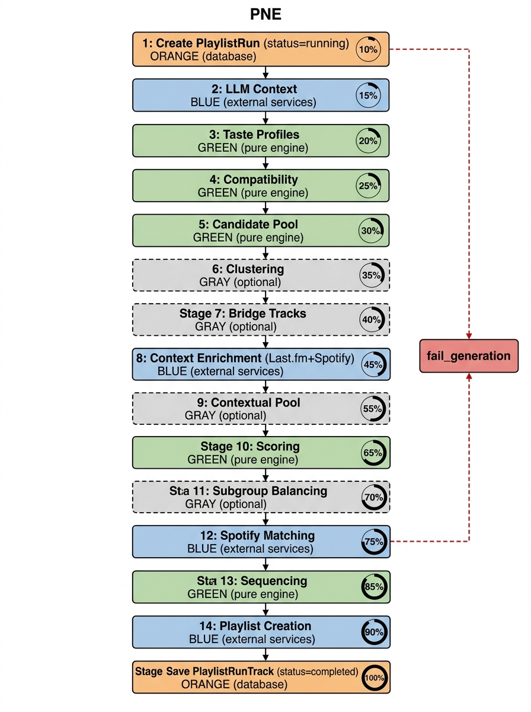

# 02 — Pipeline de Dados do PNE



```mermaid
flowchart TD
    %% Classes de Cores
    classDef engine fill:#e8f5e9,stroke:#2e7d32,stroke-width:2px,color:#000
    classDef external fill:#e3f2fd,stroke:#1565c0,stroke-width:2px,color:#000
    classDef database fill:#fff3e0,stroke:#e65100,stroke-width:2px,color:#000
    classDef optional fill:#f5f5f5,stroke:#9e9e9e,stroke-width:2px,stroke-dasharray: 5 5,color:#000

    Start([Início: Host solicita geração]) --> S1
    
    S1[1. Entrada e Persistência Inicial<br/>Cria PlaylistRun<br/>status=running] ::: database
    S1 --> S2
    
    S2[2. Contexto LLM<br/>llm_client gera ContextCriteria<br/>fallback determinístico] ::: external
    S2 --> S3
    
    S3[3. Perfis de Gosto<br/>UserMusicSnapshot[] → UserTasteProfile[]<br/>taste.py] ::: engine
    S3 --> S4
    
    S4[4. Compatibilidade<br/>calculate_group_compatibility<br/>taste.py] ::: engine
    S4 --> S5
    
    S5[5. Pool de Candidatas<br/>generate_candidate_pool<br/>candidates.py] ::: engine
    S5 --> S6
    
    S6[6. Clusterização<br/>cluster_taste_profiles<br/>clustering.py (se ≥ 3 membros)] ::: optional
    S6 --> S7
    
    S7[7. Músicas-Ponte<br/>evaluate_bridge_candidate<br/>bridge.py] ::: optional
    S7 --> S8
    
    S8[8. Enriquecimento Contextual<br/>TrackContextCache (Last.fm + Spotify)<br/>context_enrichment_service.py] ::: external
    S8 --> S9
    
    S9[9. Pool Contextual<br/>Mescla de candidatos por tags<br/>contextual_pool_service.py] ::: optional
    S9 --> S10
    
    S10[10. Scoring<br/>calculate_group_score (context+vibe+fairness)<br/>scoring.py / fairness.py] ::: engine
    S10 --> S11
    
    S11[11. Balanceamento de Subgrupos<br/>balance_subgroup_candidates<br/>subgroup_balance.py] ::: optional
    S11 --> S12
    
    S12[12. Matching Spotify<br/>Resolve e calcula match_confidence<br/>track_matcher.py + spotify_client.py] ::: external
    S12 --> S13
    
    S13[13. Sequenciamento<br/>Curva de energia e diversidade<br/>sequencer.py] ::: engine
    S13 --> S14
    
    S14[14. Criação da Playlist<br/>API Spotify no perfil do host<br/>spotify_client.py] ::: external
    S14 --> S15
    
    S15[15. Persistência Final<br/>Salva PlaylistRunTrack<br/>status=completed] ::: database
    S15 --> End([Fim da Geração])
    
    %% Tratamento de erro ilustrativo
    Fail[fail_generation<br/>Grava error_message e status=failed] ::: database
    S1 -.-> |Em caso de falha em qualquer etapa| Fail
    S12 -.-> Fail
```

Este fluxograma detalha o encadeamento (pipeline) do Motor de Recomendação de Músicas (PNE) no Vibe Check. O pipeline é coordenado pelo método `execute_generation` do arquivo `generation_service.py`.

1. **Ordenação Estrita:** O pipeline exige uma sequência estrita porque cada etapa depende da estrutura de dados processada na anterior. Para gerar uma "Pool de Candidatas" (Etapa 5), é necessário ter calculado os "Perfis de Gosto" (Etapa 3). Da mesma forma, o Scoring (Etapa 10) só pode ocorrer após o Enriquecimento Contextual (Etapa 8) avaliar as faixas contra o Contexto LLM (Etapa 2).
2. **Separação I/O vs Motor Puro:** A arquitetura distingue etapas lógicas (verdes) das etapas de I/O (azul/laranja). As etapas 3, 4, 5, 10 e 13 são puramente in-memory e implementadas na camada de `engine`, respeitando os preceitos determinísticos. Já as etapas 2, 8, 12 e 14 necessitam se comunicar com o exterior (LLM Local, Spotify, Last.fm) sendo geridas pela `Services Layer` para blindar o Motor. As etapas cinzas são isoladas via Feature Flags.
3. **Rastreabilidade de Progresso:** A cada passo no pipeline, os campos `progress_stage` (nome da etapa atual) e `progress_percent` (de 0 a 100) são atualizados e persistidos no modelo `PlaylistRun`, o que permite fornecer feedback em tempo real para a interface de carregamento do cliente.
4. **Tratamento de Erros:** Caso qualquer passo crítico do processo lance uma exceção não resolvida, o bloco de `except` aciona o método `fail_generation`, que cancela a esteira, atualiza o status para `failed` e anota o erro no campo `error_message`, evitando que playlists quebradas travem as salas dos usuários.
5. **Transformações de Dados:** O pipeline realiza progressivas transformações funcionais: a massa de dados brutos (`JSON` da API Spotify) é processada em um `UserTasteProfile`. Em seguida, as faixas dos usuários viram `CandidateTrack`, que após enriquecidas e sequenciadas, tornam-se de fato os registros finais persistidos na tabela `PlaylistRunTrack`.
6. **Mapeamento de Requisitos (PB/RF):**
   * **Etapa 2 (LLM Context):** Mapeia o **PB-17** (fallback determinístico do LLM).
   * **Etapa 4 (Compatibilidade):** Reflete a necessidade de um indicador de afinidade musical.
   * **Etapa 6 (Clusterização):** Atende ao **RF-07**, que demanda tratamento de preferências contrastantes em grupos maiores.
   * **Etapa 8 (Last.fm):** Cumpre o **RNF-08** (falhas na API secundária são silenciadas) e incrementa a semântica das faixas.
   * **Etapa 11 (Balanceamento):** Mapeia a métrica de "fairness" exigida para que nenhum membro domine a playlist.
   * **Etapa 14 (Criação no Host):** Atende ao **RF-08**, assegurando que a playlist resida unicamente na conta do usuário Host.
